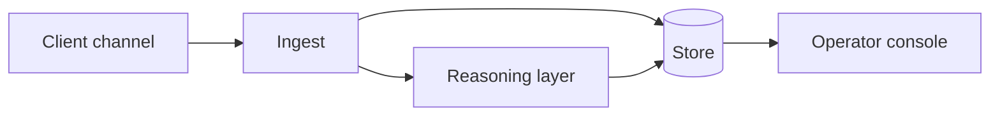

# <System name in plain words>

[English](README.md) · **Español**

> `<Sector>` · `<Geography>` · `<Year–Year>` · `<Status: in production / delivered>`

## El problema

De dos a cuatro frases. El problema de negocio, no el técnico. Qué estaba roto, cuánto
costaba y por qué la solución obvia no funcionaba.

## Restricciones

La parte interesante. Qué era innegociable y condicionó cada decisión: límites
regulatorios, un sistema heredado que no se podía tocar, los límites de tasa de una
plataforma, un techo de coste, un requisito offline-first, un equipo de una sola persona.

## Arquitectura

De tres a cinco frases recorriendo el diagrama. Dónde vive el estado, qué es síncrono y qué
no, y dónde se le permite fallar al sistema.

## Stack

**Runtime** · <languages, frameworks>
**Plataforma** · <cloud services>
**Datos** · <stores>
**IA/ML** · <models, embeddings, retrieval>

## Integraciones

| Sistema | Papel | Notas |
|---|---|---|
| <platform> | <what it does here> | <constraint worth knowing> |

## Decisiones que merece la pena explicar

**<Decision>.** Alternativas consideradas: <A>, <B>. Elegimos <X> porque <reason>.
El coste de esa elección es <trade-off>.

(Dos o tres de estas. Esta sección es la que un ingeniero senior lee de verdad.)

## Resultados

| Métrica | Antes | Después |
|---|---|---|
| <what was measured> | <baseline> | <outcome> |

Solo cifras medidas. Nada de estimaciones presentadas como resultados. Si algo no se midió,
decirlo en vez de dar a entender lo contrario.

## Qué haríamos distinto

Un párrafo honesto. Esta sección da más credibilidad que la tabla de resultados.

## Nuestro papel

Quién hizo qué. Arquitectura, implementación, operación, o las tres. Tamaño del equipo.

---

Cliente identificado solo por sector, por política propia. En este repositorio no se nombra a ningún cliente.
En este documento no aparece código, credenciales ni datos de usuario de ningún cliente.
