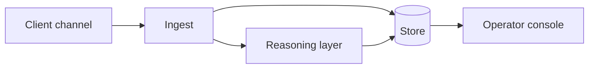

# <System name in plain words>

**English** · [Español](README.es.md)

> `<Sector>` · `<Geography>` · `<Year–Year>` · `<Status: in production / delivered>`

## The problem

Two to four sentences. The business problem, not the technical one. What was broken,
what it cost, why the obvious solution did not work.

## Constraints

The interesting part. What was non-negotiable and shaped every decision:
regulatory limits, a legacy system that could not be touched, a platform's rate limits,
a cost ceiling, an offline-first requirement, a team of one.

## Architecture

Three to five sentences walking the diagram. Where state lives, what is synchronous,
what is not, and where the system is allowed to fail.

## Stack

**Runtime** · <languages, frameworks>
**Platform** · <cloud services>
**Data** · <stores>
**AI/ML** · <models, embeddings, retrieval>

## Integrations

| System | Role | Notes |
|---|---|---|
| <platform> | <what it does here> | <constraint worth knowing> |

## Decisions worth explaining

**<Decision>.** Alternatives considered: <A>, <B>. We chose <X> because <reason>.
The cost of that choice is <trade-off>.

(Two or three of these. This section is what a senior engineer actually reads.)

## Results

| Measure | Before | After |
|---|---|---|
| <what was measured> | <baseline> | <outcome> |

Only measured figures. No estimates presented as results. If something was not
measured, say so rather than implying it.

## What we would do differently

One honest paragraph. This section buys more credibility than the results table.

## Our role

Who did what. Architecture, implementation, operation, or all three. Team size.

---

Client identified by sector only, by our own policy. No client is named in this repository.
No client code, credentials or user data appear in this write-up.
