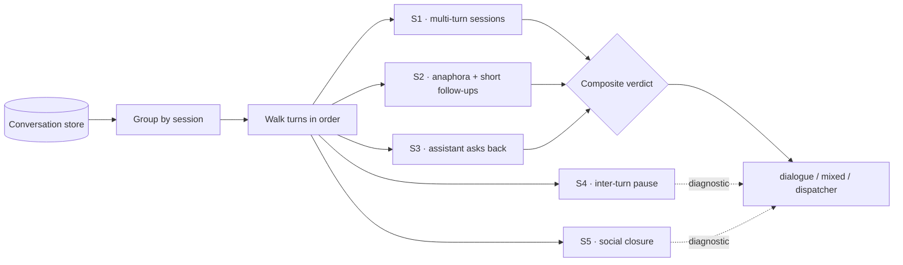

# ¿El asistente conversa de verdad o solo despacha? Medir diálogo en vez de accuracy

[English](README.md) · **Español**

`Inmobiliario` · `América Latina` · `2026` · `En producción`

## El problema

Casi todo el mundo evalúa un asistente de atención de la misma manera: se coge un conjunto de
preguntas, se comprueba si las respuestas son correctas y se reporta un número de accuracy. Esa
medición es útil y además es la equivocada para un producto conversacional, porque un sistema
puede responder bien a todas las preguntas y seguir siendo un buscador con mejor tipografía.

La pregunta que de verdad le importa al negocio es otra y es más difícil: **cuando una persona
habla con esto, ¿ocurre una conversación?** ¿Vuelve a escribir un segundo turno? ¿Se apoya en
lo ya dicho en vez de repetirlo? ¿El asistente pregunta algo de vuelta? Un asistente con
accuracy perfecta que jamás produce un segundo turno no incumple ningún control de calidad —
y tampoco es el producto que se vendió.

Así que construimos un evaluador aparte cuyo único trabajo es responder a esa pregunta, con
datos de producción y con señales que cualquiera puede comprobar.

## Por qué el accuracy solo engaña

El accuracy se mide por pregunta. La conversación es una propiedad de la *secuencia*. Las dos
cosas se separan en ambas direcciones, y los dos modos de fallo son invisibles para una suite
de accuracy:

- **Accuracy alta, cero diálogo.** Todas las respuestas son correctas y todas las sesiones son
  de un disparo. El asistente es un FAQ con latencia. El usuario obtiene su respuesta y se va —
  lo cual está bien para consultar un estado y es un fracaso de producto para un asistente de
  asesoramiento.
- **Una conversación que sostiene solo el usuario.** El usuario carga con todos los turnos; el
  asistente nunca pregunta para aclarar, nunca acota una petición ambigua. Las respuestas son
  "correctas" para la pregunta literal y erróneas para la necesidad que hay detrás.

Ninguno de los dos aparece en una puntuación por respuesta. Los dos aparecen de inmediato en
señales a nivel de turno.

## Restricciones

Esta es la parte interesante.

- **La evidencia tenía que ser tráfico de producción**, no un conjunto de prueba curado. Un
  benchmark de preguntas escritas a mano no puede mostrar si la gente real escribe un segundo
  turno, porque quien escribió el benchmark ya lo decidió de antemano.
- **Sin presupuesto de etiquetado humano.** Puntuar a mano "¿esto fue diálogo real?" no
  sobrevive al crecimiento del corpus. Cada señal tenía que ser calculable desde los turnos
  almacenados.
- **La medición tenía que ser repetible y barata.** Un evaluador que cuesta una llamada al
  modelo por conversación compite con el producto por el mismo presupuesto, así que se ejecuta
  una vez y nunca más. Este lee transcripciones guardadas y funciona solo con reglas — sin
  modelo en el bucle.
- **Tenía que poder devolver un veredicto malo.** Una evaluación que solo puede confirmar lo
  que esperabas es marketing, no medición.

## Las señales



| Señal | Qué pregunta | Por qué es evidencia de diálogo |
| --- | --- | --- |
| **Sesiones multi-turno** | ¿Qué proporción de sesiones tiene más de un mensaje del usuario? | La más decisiva con diferencia. Un despachador produce sesiones de un disparo por construcción. |
| **Anáfora en los seguimientos** | ¿Los mensajes posteriores dicen *"eso"*, *"entonces"*, *"y si"*, *"dame más"* en vez de repetir el sustantivo? | La anáfora solo se interpreta contra un contexto compartido. Un usuario que confía en que el sistema recuerda es un usuario dentro de una conversación. |
| **Seguimientos cortos** | ¿Los mensajes posteriores son réplicas breves o consultas nuevas formuladas desde cero? | La gente escribe corto cuando continúa un hilo y largo cuando abre uno. La longitud es un proxy barato de cuál de las dos cosas está pasando. |
| **El asistente repregunta** | ¿Qué proporción de turnos del asistente contiene una pregunta? | Convierte el intercambio de servir-y-olvidar en algo de dos lados, y es la señal más directamente bajo nuestro control desde el prompt. |
| **Pausa entre turnos** | Mediana de tiempo entre un mensaje del asistente y el siguiente del usuario. | Separa leer y pensar de tráfico automatizado. Una mediana de segundos a minutos es una persona leyendo; casi cero es un script. |
| **Cierre social** | *"gracias"*, *"entiendo"*, *"me sirve"*. | Débil por sí sola, corroborante en agregado: la gente da las gracias a interlocutores, no a buscadores. |

Solo las cuatro primeras puntúan. La pausa y el cierre social se reportan como diagnóstico —
son fáciles de malinterpretar en aislado (una pausa larga puede ser reflexión o una pestaña
abandonada), así que informan la lectura en vez de decidir el veredicto. Confundir "interesante"
con "decisivo" es la forma en que una puntuación compuesta se vuelve, sin hacer ruido,
infalsable.

## Cómo funciona la medición

Deliberadamente aburrido: leer las transcripciones guardadas, recorrer en orden los turnos de
cada sesión y contar. Sin modelo, sin muestreo, sin etiquetas.

```js
// Minimal, runnable illustration of the core walk.
// `sessions` is an array of { turns: [{ role, content, at }] }.

const ANAPHORA = /\b(that|those|it|then|also|what if|and how|more of|explain better)\b/i;
const SHORT_FOLLOWUP_MAX_CHARS = 60; // tuning choice, not a measured value

function signals(sessions) {
  let multiTurn = 0, followUps = 0, anaphoric = 0, short = 0;
  let assistantTurns = 0, assistantAsks = 0;
  const gaps = [];

  for (const { turns } of sessions) {
    let userCount = 0, lastAssistantAt = null;

    for (const t of turns) {
      const text = (t.content || '').trim();
      if (t.role === 'user') {
        if (++userCount > 1) {                       // a follow-up, not the opener
          followUps++;
          if (ANAPHORA.test(text)) anaphoric++;
          if (text.length <= SHORT_FOLLOWUP_MAX_CHARS) short++;
          if (lastAssistantAt != null) gaps.push(t.at - lastAssistantAt);
        }
      } else {
        assistantTurns++;
        if (text.includes('?')) assistantAsks++;
        lastAssistantAt = t.at;
      }
    }
    if (userCount >= 2) multiTurn++;
  }

  const median = xs => xs.length
    ? [...xs].sort((a, b) => a - b)[Math.floor(xs.length / 2)]
    : null;

  return {
    multiTurnRate: multiTurn / sessions.length,
    anaphoraRate: followUps ? anaphoric / followUps : 0,
    shortFollowupRate: followUps ? short / followUps : 0,
    askBackRate: assistantTurns ? assistantAsks / assistantTurns : 0,
    medianGapMs: median(gaps),
  };
}
```

El veredicto compuesto reparte después puntos por señal en una escala de dos niveles — crédito
completo en el umbral fuerte, crédito parcial en el débil — y lleva el total a tres veredictos:
*diálogo real*, *mixto: dialoga pero con sesgo a respuesta única* y *se comporta como un
despachador de FAQ*. Publicar los umbrales junto con la puntuación es justamente la gracia:
quien no esté de acuerdo con dónde está la raya puede moverla y recalcular, que es exactamente
la propiedad que debería tener una métrica de calidad.

## Stack

| Capa | Elección |
| --- | --- |
| Runtime | Node.js / TypeScript |
| Plataforma | Contenedores gestionados |
| Datos | Almacén documental, conversaciones con un array ordenado `turns` |
| IA/ML | Gama de LLM pequeña y rápida para el producto; **ningún modelo en el evaluador** |

## Decisiones que merece la pena explicar

**Reglas, no un LLM como juez.** *Alternativa considerada:* que un modelo lea cada
transcripción y puntúe la conversación. *Por qué no:* un juez LLM evaluando un producto LLM
comparte modos de fallo con él, cuesta dinero por conversación y no es reproducible entre
ejecuciones. *Coste de la decisión:* las señales por regex son superficiales — la lista de
anáforas depende del idioma y se dejará fuera formulaciones que nadie pensó, lo que convierte
la tasa reportada en un suelo, no en un techo.

**Datos de producción, no un benchmark.** *Alternativa considerada:* una suite curada de
conversaciones ejecutada en CI. *Por qué no:* lo que se está midiendo es comportamiento de
usuario, y quien escribe la suite no puede aportarlo. *Coste de la decisión:* el corpus no es
una muestra controlada, así que las cifras se mueven cuando se mueve la mezcla de tráfico —
describen a esta población, no al asistente en abstracto.

**Señales estructurales, no sentimiento.** *Alternativa considerada:* puntuar satisfacción a
partir del tono. *Por qué no:* el análisis de sentimiento sobre mensajes cortos y
transaccionales es ruidoso y halagador. Los recuentos de turnos y las marcas de tiempo no están
abiertos a interpretación.

**Reportar las señales, no solo el veredicto.** Una puntuación única es fácil de citar e
imposible de discutir. Publicar el desglose por señal permite a cualquiera ver *qué* propiedad
está floja, que es lo que hace el resultado accionable en vez de tranquilizador.

## Resultados

Ejecutado sobre el almacén de conversaciones de producción, no sobre una muestra sintética:

| Medida | Valor |
| --- | --- |
| Conversaciones analizadas | 90 |
| Turnos analizados | 520 |
| Sesiones multi-turno | 57,8% |
| Turnos del asistente que repreguntan | 70,4% |
| Mediana de pausa entre turno del asistente y réplica del usuario | 111 s |
| Veredicto compuesto | 6 de 7 señales superadas → **chat conversacional real** |

La mediana de la pausa es la cifra en la que merece la pena detenerse. Algo menos de dos
minutos entre la respuesta del asistente y el siguiente mensaje del usuario es el ritmo de
alguien que lee una respuesta, piensa y contesta. Las medianas por debajo del segundo son la
firma de scripts y reintentos; las medianas de horas son abandono y reapertura posterior. Esta
cae de lleno en la banda humana.

## Cómo se falsaría esto

Una métrica que no puedes suspender no es una métrica. El veredicto se da la vuelta con
evidencia que está disponible antes de mirarla:

- **La proporción multi-turno se desploma hacia sesiones de un disparo.** El usuario consigue
  su respuesta y se va. El producto es un FAQ y debería construirse y cobrarse como tal.
- **Los seguimientos dejan de usar anáfora y pasan a repetir el sujeto entero.** Eso es el
  usuario compensando un sistema que ha aprendido que no recuerda — un fallo de contexto que
  aflora como un cambio en la forma de escribir de la gente.
- **La tasa de repregunta del asistente se va casi a cero.** Sirve y olvida; el usuario carga
  con todo el hilo.
- **La mediana de pausa se desploma a casi cero o se dispara.** Lo primero significa que el
  tráfico no es humano; lo segundo, que las sesiones se abandonan y se reabren en vez de
  sostenerse.
- **Sube la proporción multi-turno y empeora la resolución.** La incómoda. Los turnos de más
  pueden ser interés o pueden ser el usuario preguntando lo mismo de cuatro maneras. Este
  evaluador no sabe distinguirlos, y por eso mismo se reporta al lado de la resolución y la
  satisfacción, no en su lugar.

Ese último punto es el límite honesto del método: estas señales demuestran que el diálogo está
*ocurriendo*, no que sea *bueno*. Son evidencia necesaria, no suficiente.

## Qué haríamos distinto

Ejecutarlo desde el primer día, no en la revisión. Todas las señales de aquí se calculan con
datos que el sistema ya estaba guardando, lo que significa que la serie temporal — ¿mejoró la
conversacionalidad cuando cambiamos el prompt? — existía históricamente y simplemente nunca la
dibujamos. Una métrica introducida a posteriori solo puede describir el presente; esa misma
métrica conectada desde el lanzamiento habría convertido cada cambio de prompt en un
experimento medible.

## Nuestro papel

De principio a fin: arquitectura, implementación, el método de evaluación y operación en
producción.

<sub>Cliente identificado solo por sector, por política propia. En este repositorio no se nombra a ningún cliente.</sub>
<sub>En este documento no aparece código, credenciales ni datos de usuario del cliente.</sub>
