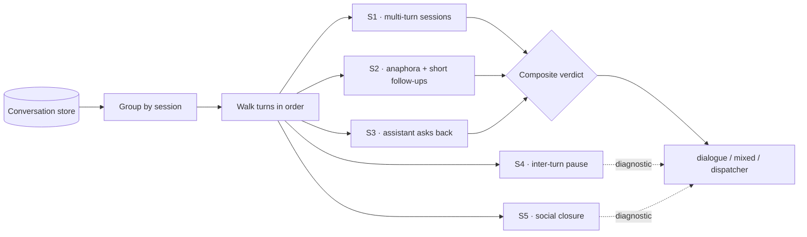

# Does the assistant actually converse, or just dispatch? Measuring dialogue instead of accuracy

**English** · [Español](README.es.md)

`Real estate` · `Latin America` · `2026` · `In production`

## The problem

Almost everyone evaluates a customer-facing assistant the same way: take a set of questions,
check whether the answers are right, report an accuracy number. That measurement is useful and
it is also the wrong one for a conversational product, because a system can answer every
question correctly and still be a search box with a friendlier font.

The question the business actually cares about is different and harder: **when a person talks
to this thing, does a conversation happen?** Do they come back for a second turn? Do they lean
on what was already said instead of restating it? Does the assistant ask anything back? An
assistant that scores perfectly on answer accuracy and never produces a second turn has not
failed a quality gate anywhere — and it is not the product that was sold.

So we built a separate evaluator whose only job is to answer that question, from production
data, with signals that can be checked by anyone.

## Why accuracy alone misleads

Accuracy is measured per question. Conversation is a property of the *sequence*. The two come
apart in both directions, and both failure modes are invisible to an accuracy suite:

- **High accuracy, no dialogue.** Every answer is right, every session is one shot. The
  assistant is a FAQ with latency. Users get an answer and leave — which may be fine for a
  status lookup, and is a product failure for an advisory assistant.
- **A conversation held together by the user alone.** The user carries every turn; the
  assistant never asks a clarifying question, never narrows an ambiguous request. Answers are
  "correct" for the literal question asked, and wrong for the need behind it.

Neither shows up in a per-answer score. Both show up immediately in turn-level signals.

## Constraints

This is the interesting part.

- **The evidence had to be production traffic**, not a curated test set. A benchmark of
  hand-written questions cannot show whether real people take a second turn, because whoever
  wrote the benchmark decided that in advance.
- **No human labelling budget.** Scoring "was this a real dialogue?" by hand does not survive
  contact with a growing corpus. Every signal had to be computable from stored turns.
- **The measurement had to be repeatable and cheap.** An evaluator that costs a model call per
  conversation competes with the product for the same budget, so it gets run once and then
  never again. This one reads stored transcripts and runs on rules only — no model in the loop.
- **It had to be able to return a bad verdict.** An evaluation that can only confirm what you
  hoped is marketing, not measurement.

## The signals



| Signal | What it asks | Why it is evidence of dialogue |
| --- | --- | --- |
| **Multi-turn sessions** | What share of sessions contain more than one user message? | The single most decisive one. A dispatcher produces one-shot sessions by construction. |
| **Anaphora in follow-ups** | Do later user messages say *"that"*, *"then"*, *"what if"*, *"more of those"* instead of restating the noun? | Anaphora is only parseable against shared context. A user who trusts the system to remember is a user in a conversation. |
| **Short follow-ups** | Are later messages brief replies rather than newly formulated queries? | People type short when they are continuing a thread and long when they are starting one. Length is a cheap proxy for which is happening. |
| **The assistant asks back** | What share of assistant turns contain a question? | Turns the exchange from serve-and-forget into a two-sided one, and is the signal most directly under our control via the prompt. |
| **Inter-turn pause** | Median time between an assistant message and the user's next one. | Separates reading and thinking from scripted or automated traffic. A median in seconds-to-minutes is a person reading; near-zero is a script. |
| **Social closure** | *"thanks"*, *"got it"*, *"that works"*. | Weak on its own, corroborating in aggregate: people thank interlocutors, not search boxes. |

Only the first four feed the score. Pause and social closure are reported as diagnostics —
they are easy to misread in isolation (a long pause can mean deep thought or an abandoned tab),
so they inform the reading rather than decide the verdict. Conflating "interesting" with
"decisive" is how composite scores quietly become unfalsifiable.

## How the measurement works

Deliberately boring: read stored transcripts, walk the turns of each session in order, count.
No model, no sampling, no labels.

```js
// Minimal, runnable illustration of the core walk.
// `sessions` is an array of { turns: [{ role, content, at }] }.

const ANAPHORA = /\b(that|those|it|then|also|what if|and how|more of|explain better)\b/i;
const SHORT_FOLLOWUP_MAX_CHARS = 60; // tuning choice, not a measured value

function signals(sessions) {
  let multiTurn = 0, followUps = 0, anaphoric = 0, short = 0;
  let assistantTurns = 0, assistantAsks = 0;
  const gaps = [];

  for (const { turns } of sessions) {
    let userCount = 0, lastAssistantAt = null;

    for (const t of turns) {
      const text = (t.content || '').trim();
      if (t.role === 'user') {
        if (++userCount > 1) {                       // a follow-up, not the opener
          followUps++;
          if (ANAPHORA.test(text)) anaphoric++;
          if (text.length <= SHORT_FOLLOWUP_MAX_CHARS) short++;
          if (lastAssistantAt != null) gaps.push(t.at - lastAssistantAt);
        }
      } else {
        assistantTurns++;
        if (text.includes('?')) assistantAsks++;
        lastAssistantAt = t.at;
      }
    }
    if (userCount >= 2) multiTurn++;
  }

  const median = xs => xs.length
    ? [...xs].sort((a, b) => a - b)[Math.floor(xs.length / 2)]
    : null;

  return {
    multiTurnRate: multiTurn / sessions.length,
    anaphoraRate: followUps ? anaphoric / followUps : 0,
    shortFollowupRate: followUps ? short / followUps : 0,
    askBackRate: assistantTurns ? assistantAsks / assistantTurns : 0,
    medianGapMs: median(gaps),
  };
}
```

The composite verdict then awards points per signal on a two-tier scale — full credit at the
strong threshold, partial credit at the weak one — and maps the total onto three verdicts:
*real dialogue*, *mixed: converses but skews to single answers*, and *behaves like a FAQ
dispatcher*. Publishing the thresholds alongside the score is the point: a reader who
disagrees with where the line sits can move it and recompute, which is exactly the property a
quality metric should have.

## Stack

| Layer | Choice |
| --- | --- |
| Runtime | Node.js / TypeScript |
| Platform | Managed containers |
| Data | Document store, conversations with an ordered `turns` array |
| AI/ML | Small fast LLM tier for the product; **no model in the evaluator** |

## Decisions worth explaining

**Rules, not an LLM judge.** *Alternative considered:* have a model read each transcript and
rate the conversation. *Why not:* an LLM judge grading an LLM product shares failure modes with
it, costs per conversation, and is not reproducible run to run. *Cost of the choice:* regex
signals are shallow — the anaphora list is language-specific and will miss phrasings nobody
thought of, which makes the reported rate a floor, not a ceiling.

**Production data, not a benchmark.** *Alternative considered:* a curated conversation suite
run in CI. *Why not:* the thing being measured is user behaviour, and a suite author cannot
supply that. *Cost of the choice:* the corpus is not a controlled sample, so the numbers move
as traffic mix moves — they describe this population, not the assistant in the abstract.

**Structural signals, not sentiment.** *Alternative considered:* score satisfaction from tone.
*Why not:* sentiment over short transactional messages is noisy and flattering. Turn counts and
timestamps are not open to interpretation.

**Report the signals, not only the verdict.** A single score is easy to quote and impossible to
argue with. Publishing the per-signal breakdown means a stakeholder can see *which* property is
weak, which is what makes the result actionable rather than reassuring.

## Results

Run over the production conversation store, not a synthetic sample:

| Measure | Value |
| --- | --- |
| Conversations analysed | 90 |
| Turns analysed | 520 |
| Multi-turn sessions | 57.8% |
| Assistant turns that ask something back | 70.4% |
| Median pause between assistant turn and user reply | 111 s |
| Composite verdict | 6 of 7 signals passed → **real conversational chat** |

The median pause is the figure worth pausing on. Just under two minutes between the assistant's
answer and the user's next message is the rhythm of somebody reading a reply, thinking, and
responding. Sub-second medians are the signature of scripts and retries; multi-hour medians are
abandonment reopened later. This sits squarely in the human band.

## How this would be falsified

A metric you cannot fail is not a metric. The verdict flips on evidence that is available
before you look at it:

- **Multi-turn share collapses toward one-shot sessions.** Users get their answer and leave.
  The product is a FAQ and should be priced and built as one.
- **Follow-ups stop using anaphora and start restating the subject in full.** That is users
  compensating for a system they have learned does not remember — a context failure showing up
  as a change in how people type.
- **The assistant's ask-back rate goes to near zero.** It serves and forgets; the user carries
  the whole thread.
- **The median pause collapses to near zero or explodes.** The first means the traffic is not
  human; the second means sessions are being abandoned and reopened, not held.
- **Multi-turn share rises while resolution gets worse.** The uncomfortable one. Extra turns
  can mean engagement or they can mean the user asking the same thing four ways. This evaluator
  cannot tell those apart, which is precisely why it is reported next to resolution and
  satisfaction rather than instead of them.

That last point is the honest limit of the method: these signals show that dialogue is
*happening*, not that it is *good*. They are necessary evidence, not sufficient.

## What we would do differently

Run it from day one, not at review time. Every signal here is computable from data the system
was already storing, which means the trend line — did conversationality improve when we changed
the prompt? — existed historically and we simply never plotted it. A metric introduced after
the fact can only describe the present; the same metric wired in at launch would have turned
every prompt change into a measurable experiment.

## Our role

End-to-end: architecture, implementation, the evaluation method, and production operation.

<sub>Client identified by sector only, by our own policy. No client is named in this repository.</sub>
<sub>No client code, credentials or user data appear in this write-up.</sub>
