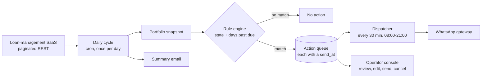

# Cobranza por WhatsApp a un mensaje cada nueve minutos, con una grieta de cobertura reducida de 179 contratos a 13

[English](README.md) · **Español**

`Servicios financieros` · `Europa` · `2026` · `En producción`

## El problema

Una financiera cobra cuotas mensuales de varios cientos de contratos activos. Alguien tiene que
saber, cada mañana, a quién le vence la cuota, quién lleva un día de retraso, quién lleva quince
y quién dejó de pagar hace meses sin decir nada — y luego escribirle a cada uno su mensaje de
WhatsApp, a mano, desde un teléfono.

Los avisos enviados antes del vencimiento son la cobranza más barata que existe. Solo funcionan
si salen todos los días sin que nadie tenga que acordarse. Hecho a mano, los días en que no salen
son invisibles: nadie abre una incidencia por un mensaje que nunca se escribió.

## Restricciones

Esta es la parte interesante.

- **WhatsApp bloquea a quien envía como una máquina.** No es una hipótesis: la plataforma marcó
  el número como spam tras unos 97 mensajes en 6 horas, unos 16 por hora. Esa única observación
  es el origen de todos los números de ritmo del sistema.
- **El libro de registro es un SaaS de gestión de préstamos ajeno.** El estado de la cartera, las
  cuotas y los días de mora salen de LoanDisk por una API REST paginada, con límites de peticiones
  y la meteorología habitual de 429 y 500. Se lee una vez al día, no de forma continua.
- **El ciclo de evaluación corre dentro de una función con un techo duro de 540 segundos.** Lo que
  haga el ciclo, lo hace en nueve minutos.
- **Los pagos llegan tarde al libro de registro.** Las transferencias las concilia una persona.
  Reclamarle a quien ya pagó es peor que no reclamar, así que el ciclo tiene que correr *después*
  de la conciliación del día, no antes.
- **Una regla que no dispara no lanza ninguna excepción.** Aquí el fallo peligroso es el silencio,
  no el error — y el silencio es exactamente lo que acabó pasando (más abajo).

## Arquitectura

La forma de la solución es que **nada en el sistema envía nunca una ráfaga.** El ciclo diario solo
decide; cada decisión cae en una cola con su propia marca de tiempo `send_at`; un despachador
aparte se despierta cada media hora y envía únicamente lo que ya toca. Decidir y enviar son, a
propósito, dos procesos distintos con relojes distintos.

## Stack

| Capa | Elección |
| --- | --- |
| Runtime | Python / FastAPI |
| Plataforma | Contenedores gestionados más una función programada, gobernados por cron |
| Datos | Almacén documental: un snapshot de cartera y un documento de acciones por día |
| Notificaciones | Proveedor de email transaccional (SendGrid) para los resúmenes diarios |

## Integraciones

| Sistema | Papel |
| --- | --- |
| LoanDisk (SaaS de gestión de préstamos) | Cartera, cuotas, días de mora, estado de pago |
| Pasarela de WhatsApp | Entrega de mensajes y callbacks de estado de entrega |
| Email transaccional | Resumen diario y previsualización para el equipo de cobranza |

## Decisiones que merece la pena explicar

**Una cola con marca de tiempo, no un bucle de envío.** *Alternativa considerada:* recorrer las
decisiones del día e irlas enviando. *Por qué no:* ese es justo el patrón que hizo que marcaran el
número — el envío manual venía dando ráfagas muy por encima de lo que tolera la plataforma.
*Coste de la decisión:* dos piezas móviles en vez de una, y una familia de bugs que en un bucle de
envío no existe: mensajes programados para una franja que ya pasó cuando cambia el día. Por eso el
despachador barre siete días hacia atrás, no solo el día en curso.

**Un suelo de ritmo, no una media.** El sistema impone un mínimo de 540 segundos entre dos
mensajes — unos 6,7 por hora — dentro de una ventana de 08:00 a 21:00 hora de Madrid, con un tope
duro de 90 mensajes por corrida. *Alternativa considerada:* repartir N mensajes uniformemente a lo
largo de la ventana, que es la respuesta evidente de cualquier planificador. *Por qué no:* una
media no es un suelo. El reparto uniforme más el jitter que hace que el tráfico parezca humano
produce tan ricamente dos mensajes separados por 40 segundos, y la plataforma no corrige por
medias. Por eso el suelo se vuelve a imponer *después* del jitter, en una pasada aparte. *Coste de
la decisión:* en un día cargado, el excedente no cabe. Se queda en cola como pendiente en lugar de
enviarse — visible, nunca descartado en silencio.

**Rellenar huecos en vez de reprogramar.** Cuando una corrida ocurre con mensajes ya programados,
los nuevos envíos se encajan en los huecos libres en vez de recalcular el día entero: cada
candidato tiene que estar al menos a un suelo de ritmo de cada franja ya ocupada *y* de cada
franja colocada en la misma pasada, con un jitter que solo puede retrasar un mensaje, nunca
adelantarlo.

**Reglas de negocio con ventana horaria.** Cada regla declara cuándo puede disparar — mañana,
tarde o a cualquier hora — porque un recordatorio de pago a las 22:00 se lee como acoso. *Coste de
la decisión:* el motor de reglas pasa a depender de la hora del reloj, lo que convirtió un cambio
rutinario de horario en una caída. Ver más abajo.

**Ampliar el flag de forzado existente en vez de añadir un bypass.** Recuperar un ciclo perdido
exigía poder ignorar la ventana horaria. *Alternativa considerada:* un parámetro nuevo. *Por qué
no:* un bypass nuevo es una vía nueva para que la corrida automática lo adquiera por accidente. En
su lugar se propagó el flag de "forzar" ya existente y auditado hasta el motor de reglas, de modo
que el único parámetro que ya significaba "sé lo que estoy haciendo" ahora lo significa de forma
coherente.

**Una alarma que el sistema calcula contra su propio histórico.** El ciclo compara el número de
acciones de hoy con la media de los últimos tres o más ciclos completados, y levanta una alarma de
nivel error, persistida como flag, cuando hoy cae por debajo del 50% de esa media. No existe un
umbral absoluto correcto para "salieron pocos mensajes" — pero sí existe uno relativo.

## Resultados

| Medida | Antes | Después |
| --- | --- | --- |
| Contratos en mora que no encajaban con ninguna regla | 179 | ~13 |
| Reglas que no podían disparar nunca (estado y día incompatibles) | 48 | 0 |
| Reglas con cadencia recurrente en vez de día exacto | 0 | 21 |
| Acciones generadas en el ciclo afectado por la caída | 4 | 32 |

Los ~13 residuales son deliberados: caen en días sin punto de contacto de una secuencia de
onboarding graduada, donde el comportamiento correcto es el silencio. Las 32 acciones recuperadas
están dentro del rango histórico de ese sistema, de 23 a 44 por ciclo, que es como sabemos que la
recuperación fue completa y no simplemente distinta de cero.

Estas cifras salen de consultas contra producción y del estado guardado de ciclos concretos de
producción. **A propósito no publicamos ni volumen mensual de mensajes ni tasa de éxito de
entrega.** Hay cifras de ambos en documentos internos, pero no pudimos trazarlas hasta una
medición que pudiéramos repetir, y un número que no sabemos volver a derivar no es un resultado.

## El incidente que merece la pena leer

El ciclo diario se movió de las 09:00 a las 14:00 por una buena razón de negocio: darle la mañana
al administrador para conciliar los pagos bancarios, y que el sistema deje de recordarle la cuota
a quien ya ha pagado. El cambio se hizo bien, verificando antes el estado real del scheduler, y se
desplegó.

La cobranza pasó entonces a cuatro mensajes al día. Nada falló. No saltó ninguna alerta.

Cada regla de negocio declara su ventana horaria, y la ventana de "mañana" terminaba a las 13:00.
Las 55 reglas preventivas que cubren los contratos al día y con vencimiento hoy — el 100% —
estaban en "mañana". Mover a las 14:00 la única pasada de evaluación del día la dejó fuera de
todas las ventanas configuradas, así que todas las reglas preventivas se descartaron en silencio.
Los cuatro mensajes que sí salieron pertenecían a un flujo manual de mora tardía que casualmente
no tenía ventana, y por eso el fallo parecía un bajón pequeño en vez de una parada total.

La lección generalizable — y el motivo de que esté en el manual y no solo aquí — es que **cuando
las reglas de negocio dependen de la hora del reloj, cambiar un horario es cambiar código.** Una
expresión cron no es configuración si aguas abajo alguien compara `now()` contra una ventana. La
lección secundaria viene de regalo: el nombre del propio job seguía diciendo "mañana" mucho
después de dejar de ser un job de mañana, y el comentario en el código decía otra cosa distinta.
Los nombres también se desincronizan en silencio.

## Qué haríamos distinto

Modelar los estados persistentes como cadencia, no como día exacto. Los disparadores de cobro se
construyeron como se construye una secuencia de onboarding: disparar el día 1, el 4, el 7, el 15 —
comparando los días de mora de forma *exacta*. Eso funciona mientras el cliente avanza por la
secuencia. Falla del todo con quien se queda atascado en mora prolongada: un contrato con 318 días
de mora no coincide con ningún disparador, no volverá a coincidir jamás y, por tanto, no vuelve a
saber de ti nunca más. Había 179 contratos en ese estado. El arreglo no necesitó código nuevo en
el motor — el tipo de disparador recurrente ya existía — necesitó 21 reglas configuradas con "cada
N días mientras siga en este estado" en vez de "este día exacto". Hoy construiríamos así las
reglas de estados persistentes desde el primer día, porque la comparación exacta no se degrada con
elegancia: pasa de funcionar a callar para siempre, sin ninguna señal intermedia.

## Nuestro papel

De principio a fin: arquitectura, implementación, diseño de reglas, operación en producción,
diagnóstico del incidente y recuperación.

Cliente identificado solo por sector, por política propia. En este repositorio no se nombra a ningún cliente.
En este documento no aparece código, credenciales ni datos de usuario del cliente.
