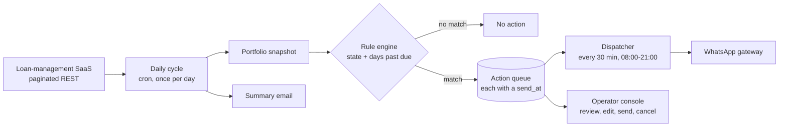

# Collections messaging on WhatsApp at one message every nine minutes, with a coverage gap closed from 179 loans to 13

**English** · [Español](README.es.md)

`Financial services` · `Europe` · `2026` · `In production`

## The problem

A lender collects monthly instalments from several hundred active contracts. Somebody has to
know, every morning, who is about to be due, who is one day late, who is fifteen days late and
who has quietly stopped paying months ago — and then write each of those people a WhatsApp
message, by hand, from a phone.

Reminders sent before the due date are the cheapest collection there is. They only work if they
go out every single day without anyone having to remember. Done by hand, the days when the
reminders do not go out are invisible: nobody files a ticket for a message that was never
written.

## Constraints

This is the interesting part.

- **WhatsApp bans senders that behave like machines.** This is not theoretical: the platform
  flagged the number as spam after roughly 97 messages in 6 hours — about 16 per hour. That one
  observation is the origin of every pacing number in the system.
- **The book of record is a third-party loan-management SaaS.** Portfolio state, instalments and
  days past due come from LoanDisk over a paginated REST API, with rate limits and the usual
  429/500 weather. It is read once a day, not continuously.
- **The evaluation cycle runs inside a function with a hard 540-second execution ceiling.**
  Whatever the cycle does, it does in nine minutes.
- **Payments reach the book of record late.** Bank transfers are reconciled by a human. Chasing
  somebody who already paid is worse than not chasing at all, so the cycle has to run *after*
  the day's reconciliation, not before.
- **A rule that does not fire raises no exception.** The dangerous failure here is silence, not
  errors — and silence is what eventually happened (below).

## Architecture

The shape of the answer is that **nothing in the system ever sends a batch.** The daily cycle
only decides; every decision lands in a queue carrying its own `send_at` timestamp; a separate
dispatcher wakes up every half hour and sends only what is due by then. Deciding and sending are
deliberately different processes running on different clocks.

## Stack

| Layer | Choice |
| --- | --- |
| Runtime | Python / FastAPI |
| Platform | Managed containers plus a scheduled function, driven by cron |
| Data | Document store: one portfolio snapshot, one action document per day |
| Notifications | Transactional email provider (SendGrid) for daily summaries |

## Integrations

| System | Role |
| --- | --- |
| LoanDisk (loan-management SaaS) | Portfolio, instalments, days past due, payment status |
| WhatsApp gateway | Message delivery and delivery-status callbacks |
| Transactional email | Daily summary and preview to the collections team |

## Decisions worth explaining

**A queue with a timestamp, not a send loop.** *Alternative considered:* iterate over the day's
decisions and send them. *Why not:* that is exactly the pattern that got the number flagged —
manual sending had been hitting bursts far above what the platform tolerates. *Cost of the
choice:* two moving parts instead of one, and a class of bug that does not exist in a send loop:
messages scheduled for a slot that has already passed when the calendar rolls over. The
dispatcher therefore sweeps seven days backwards, not just today.

**A pace floor, not an average.** The system enforces a minimum of 540 seconds between two
messages — roughly 6.7 per hour — inside an 08:00–21:00 Europe/Madrid window, with a hard cap of
90 messages per run. *Alternative considered:* spread N messages evenly across the window, which
is the obvious scheduling answer. *Why not:* an average is not a floor. Even spacing plus the
jitter that makes traffic look human will happily produce two messages 40 seconds apart, and the
platform does not grade on averages. The floor is therefore re-imposed *after* jitter, as a
separate pass. *Cost of the choice:* on a heavy day, the surplus does not fit. It stays queued as
pending rather than being sent — visible, never silently dropped.

**Fill the gaps instead of rescheduling.** When a run happens while messages are already
scheduled, new sends are slotted into the free gaps rather than recomputing the whole day: each
candidate slot must be at least the pace floor away from every already-occupied slot *and* every
slot placed in the same pass, with jitter that can only push a message later, never earlier.

**Business rules gated on time of day.** Each rule declares when it may fire — morning,
afternoon, or any time — because a payment reminder at 22:00 reads as harassment. *Cost of the
choice:* the rule engine now depends on wall-clock time, which turned a routine schedule change
into an outage. See below.

**Extend the existing force flag instead of adding a bypass.** Recovering a lost cycle needed a
way to ignore the time-of-day gate. *Alternative considered:* a new query parameter. *Why not:* a
new bypass is a new way for the automatic run to accidentally acquire it. The existing, already
audited "force" flag was threaded down into the rule engine instead, so the one parameter that
already means "I know what I am doing" now means it consistently.

**An alarm the system computes against its own history.** The cycle compares today's action count
against the average of the last three or more completed cycles and raises an error-level alarm,
persisted as a flag, when today falls below 50% of it. There is no correct absolute threshold for
"too few messages" — but there is a correct relative one.

## Results

| Measure | Before | After |
| --- | --- | --- |
| Loans in arrears matching no rule at all | 179 | ~13 |
| Rules that could never fire (state/day-count mismatch) | 48 | 0 |
| Rules with recurring cadence rather than exact-day match | 0 | 21 |
| Actions generated on the cycle hit by the outage | 4 | 32 |

The ~13 residual are deliberate: they fall on non-touchpoint days of a graduated onboarding
sequence, where the correct behaviour is silence. The 32 recovered actions sit inside that
system's historical range of 23–44 per cycle, which is how we know the recovery was complete and
not merely non-zero.

These figures come from production queries and from the stored state of specific production
cycles. **We are deliberately not publishing a monthly message volume or a delivery success
rate.** Numbers for both exist in internal documents, but we could not trace them to a
measurement we could re-run, and a number we cannot re-derive is not a result.

## The incident worth reading

The daily cycle was moved from 09:00 to 14:00 for a good business reason: give the administrator
the morning to reconcile bank payments, so the system stops reminding people who have already
paid. The change was made correctly, verified against the live scheduler, and deployed.

Collections output then dropped to four messages a day. Nothing errored. No alert fired.

Every business rule declares a time-of-day window, and the "morning" window ended at 13:00. All
55 preventive rules covering current and due-today contracts — 100% of them — were set to
morning. Moving the only evaluation pass of the day to 14:00 placed it outside every configured
window, so every preventive rule was silently skipped. The four messages that did go out belonged
to a late-stage manual flow that happened not to be gated at all, which is precisely why the
failure looked like a small dip rather than a total stop.

The generalisable lesson — and the reason it is in the handbook rather than only here — is that
**when business rules gate on wall-clock time, changing a schedule is changing code.** A cron
expression is not configuration if something downstream compares `now()` to a window. A secondary
lesson comes free: the job's own name still said "morning" long after it stopped being a morning
job, and the code comment said something different again. Names drift silently too.

## What we would do differently

Model persistent states as a cadence, not as an exact day. The collection triggers were built the
way an onboarding sequence is built: fire on day 1, day 4, day 7, day 15 — matching days past due
*exactly*. That works while a customer is moving through the sequence. It fails completely for
someone stuck in long-term arrears: a loan at 318 days past due equals no trigger, will never
again equal any trigger, and therefore never hears from you again. 179 loans were in that state.
The fix needed no new engine code — the recurring trigger type already existed — it needed 21
rules configured with "every N days while in this state" instead of "on this exact day". We would
build the persistent-state rules that way from the first day now, because exact matching does not
degrade gracefully: it goes from working to permanently silent, with no signal in between.

## Our role

End-to-end: architecture, implementation, rule design, production operation, incident diagnosis
and recovery.

Client identified by sector only, by our own policy. No client is named in this repository.
No client code, credentials or user data appear in this write-up.
