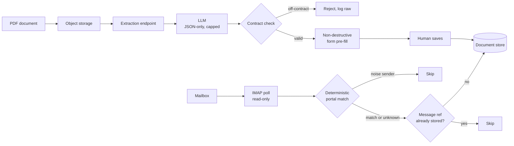

# Dos canales documentales hacia un mismo back office: un LLM que rellena un formulario pero al que nunca se le deja escribir en la base de datos, y una ingesta de correo idempotente por referencia del mensaje

[English](README.md) · **Español**

`Inmobiliario` · `Europa` · `2026` · `En producción`

## El problema

Una operación inmobiliaria recibe la materia prima de su negocio en forma de documentos, en
dos formatos que parecen no tener nada que ver y sí lo tienen.

Uno es un PDF: el dosier de una promotora, una tasación, una ficha de inmueble. Alguien tiene
que leerlo y volver a teclear precio, superficie, habitaciones, dirección, certificado
energético y una docena de campos más en un formulario de propiedad. Son minutos por documento
y el tecleo es justo donde aparecen los errores.

El otro es un correo: los portales mandan las consultas entrantes a un buzón compartido, un
mensaje por lead, con el formato que impone el portal y no la persona. Nadie lee ese buzón
como un pipeline: los leads se quedan en carpetas, se contestan o no, y no queda registro de
cuáles se llegaron a trabajar.

Los dos casos son "convertir un documento en un registro estructurado". Y piden técnicas
opuestas.

## Restricciones

Esta es la parte interesante.

- **El buzón es el sistema de registro, y no es nuestro.** Los asesores lo usan a diario. Una
  ingesta que marque mensajes como leídos, los mueva o los borre estaría destruyendo un flujo
  de trabajo humano para alimentar una base de datos.
- **Quien recogió el consentimiento fue el portal, no nosotros.** Todo lead que llega por esta
  vía es consentimiento delegado, así que ninguno puede tratarse como contactable directamente
  sin que un humano lo mire antes.
- **Un modelo es un generador de texto, no una API.** Puede devolver prosa alrededor de su
  JSON, inventarse un campo que nadie le pidió, o rellenar con toda seguridad un dato que el
  documento no menciona.
- **El volcado histórico es una única ejecución larga.** Miles de mensajes, una sola pasada, y
  cualquier caída a mitad tiene que ser segura de repetir.

## Arquitectura

La forma de la solución es que **los dos canales son deliberadamente asimétricos.** La prosa
sin estructura escrita por una persona se lleva un modelo. El correo generado por máquina que
manda un portal se lleva expresiones regulares, porque su forma es estable y un modelo sería
pagar alquiler por un problema que las reglas ya resuelven.

## Stack

| Capa | Elección |
| --- | --- |
| Runtime | Node.js / TypeScript, Next.js App Router |
| Plataforma | Contenedores gestionados, job programado contra un endpoint autenticado por OIDC |
| Datos | Almacén documental, un prefijo de colección por aplicación |
| IA/ML | Gama de LLM pequeña y rápida, modo de respuesta solo-JSON, tope de tokens de salida |
| Secretos | Gestor de secretos, acceso concedido secreto a secreto |

## Integraciones

| Sistema | Papel |
| --- | --- |
| Buzón IMAP | Canal de entrada de leads, abierto en solo lectura |
| Portales inmobiliarios | Origen de los leads, identificados por remitente más asunto |
| Almacenamiento de objetos | Subida transitoria del PDF, borrado nada más leerlo |
| Scheduler | Sondeo del buzón dos veces al día |

## Decisiones que merecen explicación

**El modelo rellena un formulario, no escribe un registro.** La extracción devuelve un objeto
candidato; un humano lo ve aterrizar en el formulario de propiedad, campo a campo, y es él
quien guarda. El relleno no es destructivo: un campo que el operador ya escribió nunca se
sobrescribe, y el asistente le informa de qué campos rellenó y cuáles dejó intactos.
*Alternativa considerada:* crear la propiedad directamente desde la extracción y que el
operador corrija después. *Por qué no:* el modo de fallo pasa a ser "existe un registro
equivocado y tiene pinta de legítimo" en vez de "una sugerencia fue rechazada". *Coste de la
decisión:* la ingesta no es desatendida — ahorra el tecleo, no la revisión.

**Pide JSON y luego da por hecho que no te ha llegado JSON.** La petición fija el modo
solo-JSON con temperatura baja y un tope duro de tokens de salida, y el prompt dice
explícitamente que un campo ausente del documento debe volver como null en vez de inventarse.
Aun así, el parser rescata por expresión regular un bloque JSON delimitado si el modelo lo
envolvió en prosa, y registra el texto crudo cuando el parseo falla, porque un fallo de parseo
que no puedes leer es un bug que no puedes arreglar. Los nulos y las cadenas vacías se
eliminan antes de que nada llegue al formulario, de modo que "el modelo no tenía opinión" y
"el modelo dijo vacío" acaban en el mismo resultado inofensivo.

**Los límites duros van en el borde, no en el modelo.** Las subidas se validan por prefijo de
ruta y extensión, los ficheros vacíos se rechazan, y cualquier cosa por encima de 55 MB se
descarta de entrada en vez de mandarse a tokenizar. El fichero subido se borra del
almacenamiento en cuanto se ha leído: el documento era un transporte, no un activo.

**Reglas para los portales, no un modelo.** Los correos de portal se reconocen por remitente
*y* por un patrón de asunto confirmado — los dos, o el lead cae en un cajón de "no
reconocido". Y lo importante: un lead no reconocido se crea igualmente. El clasificador puede
fallar; el lead no puede perderse. *Coste de la decisión:* ese cajón es un sitio donde los
problemas se esconden en silencio. Ver más abajo.

**Idempotencia por referencia del mensaje, no por checkpoint.** El checkpoint por carpeta se
escribe una sola vez, al terminar la carpeta — así que una ejecución interrumpida a mitad
vuelve a leer esa carpeta la próxima vez. Es el comportamiento buscado, porque la garantía de
verdad está en otro sitio: antes de escribir, cada lead se busca por la referencia del mensaje
original y, si ya existe, se salta. El volcado histórico lo demostró en producción, no en un
test.

**Solo lectura, siempre.** El buzón se abre con un bloqueo de solo lectura: no se marca nada
como leído, no se mueve nada, no se borra nada. Los asesores conservan el buzón que tenían; el
pipeline es invisible para ellos.

**Todo lead entra marcado para revisión.** Como el consentimiento lo recogió el portal y no
nosotros, la marca de revisión pendiente se fija incondicionalmente al construir el lead, no
se decide caso por caso. Una regla que no se puede olvidar gana a una regla que hay que
recordar.

**Indexación apagada por defecto en todo lo que no ha lanzado.** Una superficie de pruebas con
URL pública es indexable por defecto, lo que es un problema de exposición de datos disfrazado
de problema de SEO. El interruptor sale apagado y hay que encenderlo explícitamente, con dos
capas redundantes: bloqueo de rastreo y directiva noindex por página — porque bloquear el
rastreo impide rastrear pero no garantiza desindexar una URL que el buscador ya conoce. En
Next.js eso obliga a una forma concreta: una directiva que depende de una variable de entorno
no puede vivir en un objeto de metadatos exportado de forma estática, que se evalúa una sola
vez al cargar el módulo, y hay que moverla a una función generadora de metadatos.

## Resultados

**Aquí no publicamos cifras, y el motivo es justo el contenido de esta sección.** El volcado
histórico, la reparación retroactiva y la limpieza de ruido se ejecutaron una sola vez, contra
producción, con scripts desechables que se borraron tras usarlos. Sus conteos sobreviven solo
como prosa en un registro de sesión. Una cifra cuya única evidencia es un relato no es una
medición, así que no va en esta página.

Lo que sí es verificable, porque vive en código y se puede volver a ejecutar hoy:

| Afirmación | Cómo se comprueba |
| --- | --- |
| La idempotencia es por referencia del mensaje, no por checkpoint | El camino de escritura busca el registro por su referencia de mensaje original antes de cada inserción; el checkpoint por carpeta se escribe una sola vez, al terminar la carpeta |
| El buzón nunca se modifica | La conexión IMAP se abre con un bloqueo de solo lectura |
| Todo lead entra marcado para revisión | La marca se fija incondicionalmente en el constructor del lead, sin ninguna rama que pueda saltársela |
| Las subidas grandes nunca llegan al modelo | Rechazadas en el borde de la API por encima de 55 MB, y otra vez en la política de subida firmada |
| La clasificación de portal es determinista | Patrones de remitente y asunto con tests unitarios por portal |
| La suite está en verde | La suite completa de tests del monorepo pasa |

Lo que no medimos en su momento, y deberíamos: el tamaño y la composición del cajón "no
reconocido", seguidos a lo largo del tiempo. Ver más abajo.

## El incidente que merece la pena leer

El cajón de "no reconocido" hizo exactamente aquello para lo que se diseñó, y ese fue el
problema. Un portal cambió su línea de asunto; la regla estricta de remitente Y asunto dejó de
casar; y como un lead sin coincidencia se crea igualmente, no se rompió nada, no saltó ninguna
alerta y la mayoría de los leads de ese portal se fueron acumulando en silencio bajo la
etiqueta equivocada — con el nombre de contacto puesto al asunto crudo del correo en vez del
nombre de la persona. Se descubrió mirando la distribución de las etiquetas, no mirando
errores, porque no había errores.

La reparación fue mecánica una vez corregido el patrón: una actualización retroactiva de
campos sobre los registros afectados, ejecutada después de un ensayo en seco revisado y
aprobado antes. La lección generalizable es que **un cajón de descarte necesita una alarma por
umbral.** Un catch-all que nunca falla con ruido se tragará tus regresiones en silencio, y la
única señal que emite es su propio tamaño.

Hay una segunda, más pequeña, que merece la misma frase: una regla automática de ruido
construida sobre campos propios del correo funcionó sobre los registros para los que se
diseñó, y señaló un lead real de formulario web — un registro que no tenía ningún campo de
correo y que, por eso, le parecía vacío a una regla que solo miraba los campos que conocía. Se
detectó en revisión, antes de borrar. Antes de que corra una regla destructiva, lee el
registro entero — sobre todo el campo que dice de dónde vino.

## Qué haríamos distinto

Darle al clasificador una métrica de salud desde el primer día. Todos los problemas de este
documento — los leads de portal mal etiquetados, el ruido acumulándose en el cajón de
descarte, el nombre de contacto que en realidad era el asunto del correo — aparecieron
auditando datos ya guardados meses después. Ninguno habría sobrevivido a una revisión semanal
de la distribución de etiquetas, que son unas pocas líneas de código y la monitorización más
barata del sistema. Además habría dejado una serie temporal que sí merecería publicarse, en
vez de un conteo puntual de un script que ya no existe.

## Nuestro papel

De principio a fin: arquitectura, implementación, volcado histórico, reparación retroactiva de
datos, despliegue en producción y diagnóstico de incidentes.

Cliente identificado solo por sector, por política propia. En este repositorio no se nombra a ningún cliente.
En este documento no aparece código, credenciales ni datos de usuario del cliente.
