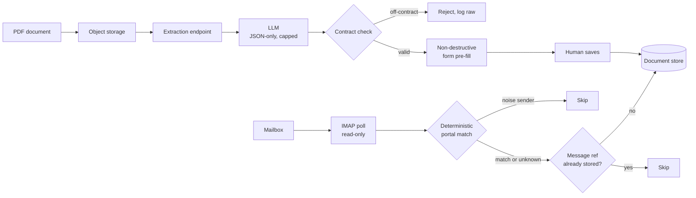

# Two document channels into one back office: an LLM that fills a form but is never allowed to write to the database, and an email ingest made idempotent by message reference

**English** · [Español](README.es.md)

`Real estate` · `Europe` · `2026` · `In production`

## The problem

A real-estate operation receives the raw material of its business as documents, in two shapes
that look unrelated and are not.

One shape is a PDF: a developer's brochure, a valuation, a listing sheet. Somebody has to read
it and retype price, surface, bedrooms, address, energy rating and a dozen more fields into a
property form. It takes minutes per document and the typing is where the errors are.

The other shape is an email: portals send inbound enquiries to a shared mailbox, one message
per lead, formatted by the portal rather than by the person. Nobody reads that mailbox as a
pipeline — leads sit in folders, get answered or don't, and there is no record of which ones
were ever worked.

Both are "turn a document into a structured record". They deserve opposite techniques.

## Constraints

This is the interesting part.

- **The mailbox is the system of record, and it is not ours.** Advisors use it every day. An
  ingest that marks messages read, moves them or deletes them would be destroying a human
  workflow to feed a database.
- **The portal is the one who collected consent, not us.** Every lead arriving this way is
  consent-by-delegation, which means none of them can be treated as directly contactable
  without a human looking first.
- **A model is a text generator, not an API.** It can return prose around its JSON, invent a
  field it was not asked for, or confidently fill a field the document never mentioned.
- **The historical backfill is a single long run.** Thousands of messages, one pass, and any
  crash halfway through has to be safe to repeat.

## Architecture

The shape of the answer is that **the two channels are deliberately asymmetric.** Unstructured
prose written by a human gets a model. Machine-generated email written by a portal gets
regular expressions, because its shape is stable and a model would be paying rent on a problem
that rules already solve.

## Stack

| Layer | Choice |
| --- | --- |
| Runtime | Node.js / TypeScript, Next.js App Router |
| Platform | Managed containers, scheduled job hitting an OIDC-authenticated endpoint |
| Data | Document store, one collection prefix per application |
| AI/ML | Small fast LLM tier, JSON-only response mode, capped output tokens |
| Secrets | Managed secret store, access bound per individual secret |

## Integrations

| System | Role |
| --- | --- |
| IMAP mailbox | Inbound lead channel, opened read-only |
| Property portals | Lead originators, identified by sender plus subject |
| Object storage | Transient upload of the PDF, deleted immediately after reading |
| Scheduler | Twice-daily poll of the mailbox |

## Decisions worth explaining

**The model fills a form, it does not write a record.** Extraction returns a candidate object;
a human sees it land in the property form, field by field, and is the one who saves. The fill
is non-destructive: a field the operator already typed is never overwritten, and the assistant
reports back which fields it filled and which it left alone. *Alternative considered:* create
the property directly from the extraction and let the operator correct it afterwards. *Why
not:* the failure mode becomes "a wrong record exists and looks legitimate" instead of "a
suggestion was declined". *Cost of the choice:* ingest is not unattended — it saves the typing,
not the reviewing.

**Ask for JSON, then assume you did not get JSON.** The request pins the response to JSON-only
mode at low temperature with a hard cap on output tokens, and the prompt states explicitly that
a field absent from the document must come back as null rather than be invented. The parser
then still salvages a fenced JSON block from the response if the model wrapped it in prose,
and logs the raw text when parsing fails, because a parse failure you cannot read is a bug you
cannot fix. Nulls and empty strings are stripped before anything reaches the form, so "the
model had no opinion" and "the model said empty" collapse into the same harmless outcome.

**Hard limits at the edge, not in the model.** Uploads are checked for path prefix and
extension, empty files are rejected, and anything above 55 MB is refused outright rather than
sent to be tokenised. The uploaded file is deleted from object storage as soon as it has been
read: the document was a transport, not an asset.

**Rules for the portals, not a model.** Portal emails are matched by sender *and* a confirmed
subject pattern — both, or the lead falls into an "unrecognised" bucket. Crucially, an
unrecognised lead is still created: the classifier can fail, the lead cannot be lost.
*Cost of the choice:* that bucket is a place where problems hide quietly. See below.

**Idempotency by message reference, not by checkpoint.** The per-folder checkpoint is written
once, at the end of the folder — so a run killed halfway re-reads that folder next time. That
is the intended behaviour, because the real guarantee is elsewhere: before writing, each lead
is looked up by the original message reference, and an existing one is skipped. The backfill
proved it in production rather than in a test.

**Read-only, always.** The mailbox is opened with a read-only lock: nothing is marked read,
moved or deleted. Advisors keep the mailbox they had; the pipeline is invisible to them.

**Every lead arrives flagged for review.** Because consent was collected by the portal and not
by us, the pending-review flag is set unconditionally at construction time, not decided per
case. A rule that cannot be forgotten beats a rule that must be remembered.

**Indexing off by default on anything pre-launch.** A staging surface with a public URL is
indexable by default, which is a data-exposure problem dressed as an SEO problem. The switch
ships off and must be turned on explicitly, with two redundant layers: a crawl block and a
per-page noindex directive — because a crawl block prevents crawling but does not guarantee
de-indexing a URL the search engine already knows. In Next.js this forces a specific shape: an
environment-dependent directive cannot live in a static exported metadata object, which is
evaluated once at module load, and has to move into a metadata-generating function.

## Results

**We are not publishing numbers for this one, and the reason is the point of the section.**
The historical backfill, the retroactive repair and the noise cleanup each ran once, against
production, driven by throwaway scripts that were deleted after use. Their counts survive only
as prose in a session log. A figure whose only evidence is a narrative is not a measurement,
so it does not go on this page.

What is verifiable, because it lives in code and can be re-run today:

| Claim | How it is checked |
| --- | --- |
| Idempotency is by message reference, not by checkpoint | The write path looks the record up by its original message reference before every insert; the per-folder checkpoint is written once, at the end of the folder |
| The mailbox is never mutated | The IMAP connection is opened with a read-only lock |
| Every lead arrives flagged for review | The flag is set unconditionally in the lead constructor, with no branch that can skip it |
| Oversized uploads never reach the model | Refused at the API boundary above 55 MB, and again in the signed-upload policy |
| Portal classification is deterministic | Sender-and-subject patterns with unit tests per portal |
| The suite is green | The full monorepo test suite passes |

What we did not measure at the time, and should have: the size and composition of the
"unrecognised" bucket, tracked over time. See below.

## The incident worth reading

The "unrecognised" bucket did exactly what it was designed to do, and that was the problem.
One portal had changed its subject line; the strict sender-AND-subject rule stopped matching;
and because an unmatched lead is still created, nothing broke, nothing alerted, and the
majority of that portal's leads quietly accumulated under the wrong label — with the contact
name silently set to the raw email subject instead of the person's name. It was found by
looking at the distribution of the labels, not by looking at errors, because there were no
errors.

The repair was mechanical once the pattern was fixed: a retroactive field update across the
affected records, executed after a dry run that was reviewed and approved first. The
generalisable lesson is that **a fallback bucket needs a threshold alarm.** A catch-all that
never fails loudly will absorb your regressions in silence, and the only signal it emits is
its own size.

A second, smaller one is worth the same sentence: an automated noise rule built on
email-specific fields worked on the records it was designed for, and flagged a genuine
web-form lead — a record that had no email fields at all, and so looked empty to a rule that
only ever looked at the fields it knew about. It was caught in review, before deletion. Before
a destructive rule runs, read the whole record — especially the field that says where it came
from.

## What we would do differently

Give the classifier a health metric from day one. Every problem in this write-up — the
mislabelled portal leads, the noise accumulating in the fallback bucket, the contact name that
was silently the email subject — was found by auditing stored data months later. None of them
would have survived a weekly check on the distribution of labels, which is a few lines of code
and the cheapest monitoring in the system. It would also have left a time series worth
publishing, instead of a one-off count from a script that no longer exists.

## Our role

End-to-end: architecture, implementation, the historical backfill, the retroactive data
repair, production deployment and incident diagnosis.

Client identified by sector only, by our own policy. No client is named in this repository.
No client code, credentials or user data appear in this write-up.
