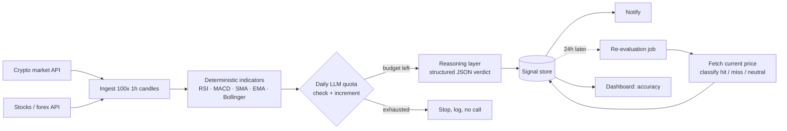

# Construimos primero el bucle de evaluación, y nos dijo que las señales acertaban el 46.1% de las veces — por debajo del azar

[English](README.md) · **Español**

`Mercados financieros` · `Global` · `2026` · `En producción`

## El problema

Un pipeline que lee datos de mercado, calcula indicadores técnicos y le pide a un modelo de
lenguaje un veredicto direccional es un proyecto de fin de semana. Eso lo monta cualquiera. Lo
que casi nadie monta es la otra mitad: el job que vuelve 24 horas después, mira qué hizo el
precio de verdad y anota si la llamada fue buena o no.

Sin esa mitad el sistema es infalsable. Emite veredictos con pinta de solventes, con su
puntuación de confianza al lado, te los manda al móvil, y no tienes forma de saber si está
haciendo algo. Este es un caso de ingeniería sobre construir la medición, y sobre qué dijo la
medición cuando por fin hubo suficiente.

Dijo 46.1%. Por debajo del azar. Y lo publicamos.

*Esto no es consejo de inversión y el sistema nunca se usó para operar con dinero real. Es un
pipeline de investigación personal, para revisión humana, y lo interesante es el arnés de
evaluación, no las señales.*

## Restricciones

- **El veredicto no se puntúa solo.** Un modelo puede devolver `confidence: 85` toda la vida
  sin que nada lo contradiga nunca. Cerrar el bucle contra el precio real posterior era
  requisito desde el primer boceto de diseño, no un añadido tardío.
- **Hay que definir "acertar" antes de medirlo.** Un precio que se mueve un 0.1% no es acierto
  ni fallo: es ruido. Sin una banda neutra explícita, cada medición es una decisión que tomaste
  sin darte cuenta.
- **Dos proveedores de datos con formas distintas.** La cripto venía de una API pública
  gratuita; la bolsa y el forex, de una de pago — distinta autenticación, distintos límites de
  peticiones, distinto orden de las velas, y uno de los dos devuelve errores como HTTP 200 con
  un campo de estado en el cuerpo.
- **El gasto en LLM había que acotarlo antes de la primera ejecución**, no auditarlo después de
  la primera factura.
- **Que falle un símbolo no puede tumbar el ciclo.** Seis instrumentos por ejecución, cada uno
  cruzando la red tres veces.

## Arquitectura

La línea punteada es todo el asunto. Lo que hay por encima es la parte fácil.

**Los indicadores se calculan en código, nunca los calcula el modelo.** RSI, MACD, medias
móviles y bandas de Bollinger son aritmética determinista; dárselos a un modelo de lenguaje
sería pagar por indeterminismo donde el determinismo salía gratis. El modelo recibe los números
ya calculados y produce únicamente el veredicto narrativo.

## Stack

| Capa | Elección |
| --- | --- |
| Runtime | Node.js / TypeScript |
| Plataforma | Cloud Functions (Gen2), programadas cada 6h |
| Datos | Firestore (señales, configuración de watchlist, contador de cuota) |
| Indicadores | `technicalindicators` — RSI 14, MACD 12/26/9, SMA 50, EMA 20, Bollinger 20/2 |
| IA/ML | Gama flash de Gemini, esquema JSON estructurado, `thinkingBudget: 0`, `temperature: 0.2`, salida topada a 1024 tokens |
| Dashboard | Next.js, Firebase Auth con lista blanca de una sola dirección |

## Integraciones

| Sistema | Papel |
| --- | --- |
| API pública de Binance | Velas OHLC de cripto, sin API key |
| TwelveData | Velas OHLC de bolsa y forex, key de pago |
| Telegram | Entrega de la señal a una persona |

## Decisiones que merecen explicación

**Definir la banda neutra antes de medir, y dejar escrito por qué.** BUY acierta si el precio
subió ≥0.5%, falla si bajó ≥0.5%, y queda neutro en medio. SELL es el espejo. HOLD es binario y
nunca neutro: acierta si el precio se quedó *dentro* de la banda, porque un movimiento grande en
cualquier dirección significa que HOLD estaba equivocado. *Coste de la decisión:* el 0.5% es un
juicio, y otra banda da otro titular. La defensa es que quedó fijada de antemano y documentada
en el código, así que no se puede ajustar a posteriori para que el resultado quede más guapo.

**El neutro se excluye por completo de la fracción de acierto.** La métrica es
`hit / (hit + miss)`; los neutros se cuentan y se muestran aparte, pero no entran ni en el
numerador ni en el denominador. Meterlos en el denominador habría dado 36.3% (65/179); contarlos
como aciertos habría dado 57.5% (103/179). Ninguna de las dos mide habilidad direccional: las
dos miden cuánto tiempo estuvo tranquilo el mercado. *Coste de la decisión:* el número honesto
es el más duro de los tres.

**Cuota fail-closed, dentro de una transacción, en la base de datos.** El presupuesto diario de
llamadas al LLM vive en Firestore y se comprueba-e-incrementa dentro de una sola transacción,
porque los símbolos se procesan en paralelo y el runtime puede escalar a varias instancias — un
contador en memoria no se compartiría entre ellas. Si falla la propia comprobación de cuota, la
llamada se deniega en lugar de darse por segura.

**Tope de tokens de salida y razonamiento desactivado.** El veredicto es un objeto JSON
estructurado y corto. Un tope duro convierte la parte invisible de la factura en algo acotado en
vez de algo que descubres.

**Aislamiento por elemento en todas partes.** Ningún módulo de red lanza excepciones. Cada
ingesta, cálculo de indicadores, llamada al modelo y evaluación devuelve
`{ok: true, ...} | {ok: false, reason}`, y el ciclo usa `Promise.allSettled`. Un símbolo muerto
te cuesta ese símbolo.

## Resultados

**La medición, completa:**

| Medida | Valor |
| --- | --- |
| Accuracy global | **46.1%** (65 hit / 76 miss) |
| Muestra | 179 señales evaluadas de 202 generadas |
| Ventana | 2026-09-02 → 2026-09-10 (~8 días) |
| Neutras (excluidas de la fracción) | 38 |

Una tasa de acierto sin denominador no es una medición, así que: **65 aciertos sobre 141 señales
decididas, a lo largo de unos ocho días de producción, sobre seis instrumentos.**

**El desglose vale más que el titular:**

| Corte | Resultado |
| --- | --- |
| Por tipo de señal | SELL 62.5% · HOLD 46.8% · **BUY 35.5%** (11 hit / 20 miss) |
| Confianza del modelo 60–69 | 49.4% de acierto |
| Confianza del modelo 80–89 | 40.0% de acierto |
| Mejor instrumento | EURUSD — HOLD 15 hit / 0 miss |
| Peor instrumento | SOLUSDT — HOLD 2 hit / 16 miss |

Tres cosas con las que conviene quedarse un rato.

**El pipeline funciona; el producto no.** Ingesta, indicadores, persistencia, evaluación y
entrega hacen exactamente lo que está especificado, con 92 tests en verde. El sistema es
correcto e inútil. Son dos ejes independientes, y solo el bucle de evaluación sabe
distinguirlos.

**La confianza que declara el modelo no está calibrada — si acaso, está invertida.** Las señales
que el modelo puntuó entre 80 y 89 acertaron *menos* que las que puntuó entre 60 y 69. Ese campo
parece información y no lo es. Cualquier lógica aguas abajo que filtre u ordene por la confianza
declarada está construyendo sobre arena, y eso hubo que descubrirlo midiendo, no leyendo el
número y creyéndoselo.

**El agregado escondía la distribución.** Un instrumento (SOLUSDT, 2 hit / 16 miss en HOLD)
arrastraba una parte apreciable de la cifra global, mientras otro (EURUSD, 15 hit / 0 miss)
pintaba excelente. Publicar solo el 46.1% habría sugerido "el modelo es mediocre en todas
partes". No lo es: está gravemente equivocado en sitios concretos, que es un problema distinto y
mucho más accionable.

**Qué hicimos con ello.** El hallazgo se convirtió en un ticket de producto, no en un parche:
ejemplos few-shot de aciertos y fallos históricos en el prompt, un array `keyFactors`
obligatorio y ordenado *antes* del veredicto en el esquema de respuesta (obligando al modelo a
enunciar sus razones antes de comprometerse, un sustituto de cadena de razonamiento compatible
con el razonamiento desactivado), y una compuerta de notificación asimétrica: BUY solo llega al
móvil por encima de un umbral mínimo de confianza, SELL llega siempre, porque BUY era el tipo
débil y SELL el fuerte. Desplegado el 2026-09-11. **Si sirvió de algo es una pregunta abierta**:
el paso correcto es repetir la misma consulta y la misma fórmula sobre una ventana posterior, y
hasta que eso se haga no hay resultado que reportar aquí. Publicar "lo arreglamos" por el mérito
de haber desplegado algo sería exactamente el fallo del que trata este caso.

## Dónde está de verdad el límite de un LLM sobre datos de mercado

Un modelo de lenguaje razona sobre la narrativa, no sobre la distribución. Dados un RSI, un MACD
y una posición en las bandas de Bollinger, producirá un relato fluido y plausible de lo que esos
valores significan — y ese relato sale de cómo se *describen* esas configuraciones en textos, no
de ninguna estimación de probabilidad condicional. Es un generador de explicaciones muy bueno
apuntando a un problema que pide un estimador.

Eso no es un fallo de prompt engineering, y no creemos que un prompt mejor cierre la brecha. Es
una cuestión de categoría, y es el tipo de cosa que solo se hace visible cuando obligas al
sistema a llevar el marcador.

## Qué haríamos distinto

**Construir el bucle de evaluación primero, antes que el generador de señales.** Lo construimos
pronto, lo cual estuvo bien, pero aterrizó después del pipeline — y eso significó que la primera
semana de producción corrió acumulando señales sin que nada las puntuara. Durante ocho días, la
respuesta honesta a "¿esto funciona?" era "todavía no lo sabemos". Si el evaluador existe
primero, cada señal nace dentro de un sistema que tarde o temprano la corregirá, y la pregunta
tiene respuesta desde el día uno.

**Que la consulta de medición viaje con el repositorio.** Cuando llegó el momento de calcular la
primera cifra de accuracy no había script de consulta en el código — los números se extrajeron
en vivo del almacén de datos, a mano. Una medición que tienes que reconstruir a mano es una
medición que vas a repetir menos de lo que deberías, y repetirla es justo lo que este caso
necesita a continuación.

**Segmentar antes de agregar.** El número global estuvo a punto de costarnos los dos hallazgos
que importaban (BUY frente a SELL, y la dispersión por instrumento). Cualquier panel de accuracy
que hagamos a partir de ahora enseña los cortes al lado del total, no detrás de un clic.

## Nuestro papel

Todo: arquitectura, PRD, implementación, suite de tests, modelo de costes, despliegue, operación
en producción y la medición que produjo el número incómodo.

Este es un proyecto interno de S2A2, no trabajo de cliente; se mantiene el mismo formato de aviso por coherencia.
En este documento no aparecen credenciales, identificadores de infraestructura ni datos de usuario. Nada de lo aquí escrito es consejo de inversión.
