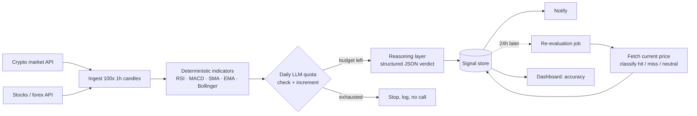

# We built the evaluation loop first, and it told us the signals were right 46.1% of the time — below a coin flip

**English** · [Español](README.es.md)

`Financial markets` · `Global` · `2026` · `In production`

## The problem

A pipeline that reads market data, computes technical indicators and asks a language model
for a directional verdict is a weekend project. Anyone can build one. What almost nobody
builds is the other half: the job that comes back 24 hours later, looks up what the price
actually did, and writes down whether the call was right.

Without that half, the system is unfalsifiable. It emits confident-looking verdicts with a
confidence score attached, delivers them to your phone, and you have no way to tell whether
it is doing anything at all. This is an engineering case about building the measurement, and
about what the measurement said when we finally had enough of it.

It said 46.1%. Below chance. We are publishing that.

*This is not investment advice and the system was never used to trade real money. It is a
personal research pipeline for human review, and the interesting part is the evaluation
harness, not the signals.*

## Constraints

- **The verdict is not self-scoring.** A model can return `confidence: 85` forever without
  ever being contradicted. Closing the loop against the real subsequent price was a
  requirement from the first design sketch, not an afterthought.
- **"Right" has to be defined before you measure it.** A price that moves 0.1% is not a hit
  and not a miss — it is noise. Without an explicit neutral band, every measurement is a
  choice you made accidentally.
- **Two data providers with different shapes.** Crypto came from a free public API, stocks
  and forex from a paid one — different authentication, different rate limits, different
  candle ordering, and one of them reports errors as HTTP 200 with a status field in the body.
- **LLM spend had to be bounded before the first run**, not audited after the first bill.
- **Any single symbol failing must not take the cycle down.** Six instruments per run, each
  crossing the network three times.

## Architecture

The dotted line is the whole point. Everything above it is the easy part.

**Indicators are computed in code, never by the model.** RSI, MACD, moving averages and
Bollinger bands are deterministic arithmetic; handing them to a language model would be
paying for non-determinism where determinism was free. The model receives the computed
numbers and produces only the narrative verdict.

## Stack

| Layer | Choice |
| --- | --- |
| Runtime | Node.js / TypeScript |
| Platform | Cloud Functions (Gen2), scheduled every 6h |
| Data | Firestore (signals, watchlist config, quota counter) |
| Indicators | `technicalindicators` — RSI 14, MACD 12/26/9, SMA 50, EMA 20, Bollinger 20/2 |
| AI/ML | Gemini flash tier, structured JSON schema, `thinkingBudget: 0`, `temperature: 0.2`, output capped at 1024 tokens |
| Dashboard | Next.js, Firebase Auth behind a single-address allowlist |

## Integrations

| System | Role |
| --- | --- |
| Binance public API | Crypto OHLC candles, no API key |
| TwelveData | Stocks and forex OHLC candles, paid key |
| Telegram | Signal delivery to a human |

## Decisions worth explaining

**Define the neutral band before measuring, and write down why.** BUY is a hit if the price
rose ≥0.5%, a miss if it fell ≥0.5%, neutral in between. SELL is the mirror. HOLD is binary
and never neutral: it hits if the price stayed *inside* the band, because a large move in
either direction means HOLD was wrong. *Cost of the choice:* 0.5% is a judgement call, and a
different band gives a different headline number. The defence is that it was fixed in advance
and documented in the code, so it cannot be tuned after the fact to make the result look
better.

**Neutral is excluded from the accuracy fraction entirely.** The metric is
`hit / (hit + miss)`; neutrals are counted and displayed separately but appear in neither
numerator nor denominator. Folding them into the denominator would have reported 36.3%
(65/179); calling them hits would have reported 57.5% (103/179). Neither is a measurement of
directional skill — both are a measurement of how often the market was quiet. *Cost of the
choice:* the honest number is the harshest of the three.

**Fail-closed quota, in a transaction, in the database.** The daily LLM call budget lives in
Firestore and is checked-and-incremented inside a single transaction, because symbols are
processed concurrently and the runtime can scale to multiple instances — an in-memory counter
would not be shared between them. If the quota check itself fails, the call is refused rather
than assumed safe.

**Capped output tokens and reasoning disabled.** The verdict is a short structured JSON
object. A hard output cap makes the invisible portion of the bill bounded rather than
discovered.

**Per-item isolation everywhere.** No network module throws. Every ingest, indicator, model
call and evaluation returns `{ok: true, ...} | {ok: false, reason}`, and the cycle uses
`Promise.allSettled`. One dead symbol costs you that symbol.

## Results

**The measurement, in full:**

| Measure | Value |
| --- | --- |
| Overall accuracy | **46.1%** (65 hit / 76 miss) |
| Sample | 179 evaluated signals out of 202 generated |
| Window | 2026-09-02 → 2026-09-10 (~8 days) |
| Neutral (excluded from the fraction) | 38 |

A hit rate without a denominator is not a measurement, so: **65 hits out of 141 decided
signals, over roughly eight days of production, across six instruments.**

**The breakdown is more useful than the headline:**

| Cut | Result |
| --- | --- |
| By signal type | SELL 62.5% · HOLD 46.8% · **BUY 35.5%** (11 hit / 20 miss) |
| Model confidence 60–69 | 49.4% accuracy |
| Model confidence 80–89 | 40.0% accuracy |
| Best instrument | EURUSD — HOLD 15 hit / 0 miss |
| Worst instrument | SOLUSDT — HOLD 2 hit / 16 miss |

Three things worth sitting with.

**The pipeline works; the product does not.** Ingestion, indicators, persistence, evaluation
and delivery all do exactly what they are specified to do, with 92 passing tests. The system
is correct and useless. Those are independent axes, and only the evaluation loop can tell
them apart.

**The model's confidence score is not calibrated — if anything it is inverted.** Signals the
model rated 80–89 were *less* accurate than ones it rated 60–69. That field looks like
information and is not. Any downstream logic that filters or ranks on declared confidence is
building on sand, and we had to find that out by measuring rather than by reading the number
and believing it.

**The aggregate hid the distribution.** One instrument (SOLUSDT, 2 hit / 16 miss on HOLD)
dragged a meaningful share of the global figure, while another (EURUSD, 15 hit / 0 miss)
looked excellent. Reporting only 46.1% would have suggested "the model is mediocre
everywhere". It is not; it is badly wrong in specific places, which is a different and more
actionable problem.

**What we did with it.** The finding became a product ticket, not a patch: few-shot examples
of historical hits and misses in the prompt, a mandatory `keyFactors` array ordered *before*
the verdict in the response schema (forcing the model to state its reasons before committing,
a chain-of-thought substitute compatible with reasoning disabled), and an asymmetric
notification gate — BUY now only reaches the phone above a minimum confidence threshold, SELL
always does, because BUY was the weak type and SELL was the strong one. Shipped 2026-09-11.
**Whether it helped is an open question**: the correct next step is to re-run the same query
and the same formula on a later window, and until that is done there is no result to report
here. Publishing "we fixed it" on the strength of having deployed something would be exactly
the failure this case study is about.

## Where the limit of an LLM on market data actually is

A language model reasons over the narrative, not over the distribution. Given RSI, MACD and a
Bollinger position, it will produce a fluent, plausible account of what those values mean —
and that account is generated from how such setups are *described* in text, not from any
estimate of conditional probability. It is a very good explanation generator pointed at a
problem that wants an estimator.

That is not a prompt engineering failure and we do not think a better prompt closes the gap.
It is a category question, and it is the kind of thing that only becomes visible when you
force the system to keep score.

## What we would do differently

**Build the evaluation loop first, before the signal generator.** We built it early, which
was right, but it landed after the pipeline — and that meant the first production week ran
with signals accumulating and nothing scoring them. For eight days the honest answer to "is
this working?" was "we don't know yet". If the evaluator exists first, every signal is born
into a system that will eventually grade it, and the question is answerable from day one.

**Ship the measurement query with the repository.** When the time came to compute the first
accuracy figure there was no query script in the codebase — the numbers were extracted live
from the datastore by hand. A measurement you have to reconstruct by hand is a measurement
you will run less often than you should, and re-running it is precisely what this case needs
next.

**Segment before you aggregate.** The global number nearly cost us the two findings that
mattered (BUY vs SELL, and the instrument-level spread). Any accuracy dashboard we build from
now on shows the cuts next to the total, not behind a click.

## Our role

Everything: architecture, PRD, implementation, test suite, cost model, deployment, production
operation, and the measurement that produced the uncomfortable number.

This is an internal S2A2 project, not client work; the same disclosure format is kept for consistency.
No credentials, infrastructure identifiers or user data appear in this write-up. Nothing here is investment advice.
