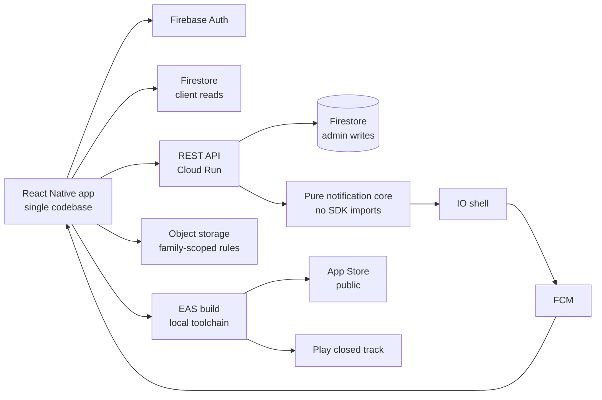

# Una app social nativa sin salida de emergencia por aire: cada cambio de JavaScript es un envío a tienda

[English](README.md) · **Español**

`Consumo / social` · `Europa` · `2026` · `En producción`

## El problema

Una red social privada para familias: muros compartidos, momentos, chat, retos, agenda y
límites de tiempo de pantalla para los menores. Un solo producto, dos sistemas operativos,
adultos y niños en el mismo grafo, y un régimen de consentimiento que trata distinto a un
chaval de 13 años, a uno de 17 y a un adulto.

Lo evidente aquí es hacer dos bases de código nativas y montar dos equipos. Eso no estaba
sobre la mesa. La restricción era una sola base de código, un equipo pequeño y una publicación
real en tienda — no una demo, no un artefacto que vive solo en TestFlight.

## Restricciones

Esta es la parte interesante.

- **Sin actualizaciones por aire.** La app se publica sin módulo de actualización OTA. No hay
  clave `updates` en el manifiesto de la app ni dependencia de actualización en el manifiesto
  de paquetes. La consecuencia es absoluta: *cada* cambio de JavaScript — un retoque de copy,
  un bug de un carácter — es una recompilación nativa y un envío a tienda. No hay vía de
  hotfix.
- **Distribución asimétrica.** La compilación de iOS es una publicación pública en App Store.
  En Android no hay ficha pública: el perfil de envío
  apunta a una pista cerrada con estado de publicación en borrador. Una base de código, dos
  realidades de release muy distintas.
- **Una cola de compilación en la nube que no controlábamos.** En el plan gratuito, una
  compilación de producción de Android estuvo encolada horas sin arrancar siquiera. Un tren de releases que depende de la cola de otro no es un tren de
  releases.
- **La entrega de push no se observa desde el emisor.** La API de mensajería te dice que ha
  aceptado un token. No te dice que una persona haya visto nada.
- **El tiempo no es aritmética.** La contabilidad de tiempo de pantalla corre sobre un día que
  empieza a las 08:00, en una zona horaria con cambio de hora. Restar ocho horas a una marca
  de tiempo está mal dos veces al año.

## Arquitectura

El diseño se sostiene sobre dos ideas. La primera: **la lógica de decisión de las
notificaciones es un módulo puro**, sin una sola importación de SDK; recibe una lista de
destinatarios, un conjunto de preferencias y un reloj inyectado, y devuelve un plan de a quién
se notifica y por qué se ha suprimido a cada uno de los demás. El envío y las lecturas viven
en una capa aparte. La segunda: **la autorización se aplica en las reglas de almacenamiento,
no solo en la app**; las rutas de objetos resuelven la familia del propietario contra la base
de datos antes de permitir una lectura.

## Stack

| Capa | Elección |
| --- | --- |
| Móvil | React Native 0.81.5 sobre Expo SDK 54, React 19.1.0, New Architecture activada |
| Build | EAS Build con credenciales locales, versión remota, autoincremento |
| Backend | Node.js / TypeScript, Express, validación de esquema en el borde |
| Plataforma | Contenedores gestionados, una sola región europea |
| Datos | Almacén documental, más almacenamiento de objetos con reglas de servidor |
| Identidad | Auth gestionado: email/contraseña, Google Sign-In, autenticación de Apple |

## Integraciones

| Sistema | Papel |
| --- | --- |
| Firebase Auth | Identidad, tres métodos de acceso |
| Firestore | Datos de aplicación, listeners de cliente y escrituras de admin |
| Firebase Storage | Multimedia, con reglas de lectura acotadas a la familia |
| FCM | Entrega de push |
| Crashlytics | Reporte de fallos |
| TestFlight / App Store | Distribución pública en iOS |
| Google Play | Solo pista de prueba cerrada |

## Decisiones que merece la pena explicar

**Ningún canal de actualización por aire.** *Alternativa considerada:* incluir el módulo OTA y
quedarnos con un carril de hotfix. *Por qué no:* añade un segundo eje de versión, invisible —
un binario en la tienda y un paquete de JavaScript que puede coincidir con él o no — y
convierte cada informe de fallo en una pregunta sobre qué paquete estaba corriendo. *Coste de
la decisión:* es un coste real y lo pagamos en cada release. Arreglar una línea de texto
cuesta una compilación nativa completa y un ciclo de revisión. La disciplina que obliga es que
la checklist previa al envío pasa a ser estructural, porque no hay forma barata de corregir un
error.

**Compilaciones locales por defecto, no como plan B.** *Alternativa considerada:* seguir en la
cola de compilación alojada. *Por qué no:* una compilación de producción estuvo encolada horas
en el plan gratuito sin arrancar, y el comando combinado de "compila ambas
plataformas y envía" aborta *las dos* cuando una choca contra el límite de cuota. *Coste de la
decisión:* una sola máquina tiene que cargar ahora con las cadenas de herramientas nativas de
las dos plataformas, y las compilaciones locales no aparecen en el listado de builds alojadas —
lo que una vez provocó una falsa alarma de que no se había publicado nada en absoluto. El
remedio es saber que ese listado no es la fuente de verdad.

**Un núcleo funcional puro para la política de notificaciones.** *Alternativa considerada:*
consultar las preferencias en línea, ahí donde se envía el push. *Por qué no:* esa lógica es
genuinamente enrevesada — 15 tipos de notificación, cada uno declarando si respeta el
interruptor de su categoría, el silencio de un hilo concreto y la ventana de modo noche; 3 de
esos tipos cruzan el modo noche a propósito porque son señales de seguridad o de cuenta. En
línea, eso no se puede probar sin un proyecto vivo. *Coste de la decisión:* una frontera de
módulo más y un objeto de plan que hay que mantener sincronizado con el emisor. A cambio, toda
la política corre bajo test unitario con reloj inyectado, incluido el caso en que la ventana de
silencio cruza la medianoche.

**Frontera del día a las 08:00, calculada sobre el calendario y no sobre el epoch.**
*Alternativa considerada:* restar ocho horas a la marca de tiempo. *Por qué no:* eso se
desvía una hora en las dos transiciones de horario de verano, lo que atribuye en silencio
tiempo de pantalla al día equivocado dos veces al año. *Cómo se hizo en su lugar:* leer la hora
de pared en la zona horaria de destino con la API de internacionalización de la plataforma y
luego mover la fecha por aritmética de calendario anclada al mediodía UTC — nunca restando
milisegundos.

**Autorización en las reglas de almacenamiento, cruzando contra la base de datos.** *Por qué:*
una auditoría de seguridad interna encontró que la lectura de multimedia estaba condicionada a
"quien llama está autenticado", que no es ninguna frontera en un producto cuya premisa entera
es que las familias están separadas. Las reglas resuelven ahora la familia del propietario
desde el documento de usuario y la comparan con la de quien llama antes de permitir la lectura,
con topes de tamaño por ruta. Las fotos de perfil y de portada se dejan a propósito fuera de
ese acotado, porque una foto de perfil está pensada para verse fuera de la familia. *Coste de
la decisión:* cada lectura de multimedia cuesta ahora una consulta de documento en tiempo de
regla.

## Resultados

Esto era un producto desde cero, así que no hay un "antes" contra el que comparar. Estas son
las propiedades medidas de lo que se publicó:

| Medida | Valor medido |
| --- | --- |
| Disponibilidad pública en iOS | publicación pública en App Store |
| Ficha pública en Android | ninguna — pista cerrada, publicación en borrador |
| Tipos de notificación con política declarada | 15 (3 saltan el modo noche a propósito) |
| Módulos de rutas del backend | 31 |
| Historias de usuario mapeadas a contratos de API | 29 |
| Scripts de smoke en el harness | 37 (29 backend, 8 móvil) |
| Aserciones en la suite del día de pantalla | 18, de las cuales 5 caen en fronteras de cambio de hora |

No publicamos aquí métricas de engagement, retención ni tasa libre de fallos. No las hemos
medido con un rigor que estemos dispuestos a defender.

## El incidente que merece la pena leer

Una notificación push no llegaba. El emisor reportaba éxito. La investigación encontró tres
fallos silenciosos *distintos* apilados uno sobre otro, y hubo que arreglar cada uno para que
el siguiente se hiciera visible.

Primero, el envío reportaba cero destinatarios: una escritura de documento completo en otro
punto del código estaba sobrescribiendo el registro de usuario y borrando de paso el token del
dispositivo. Segundo, con el token restaurado, el envío reportaba un fallo: la cuenta de
servicio de ejecución no tenía el permiso de mensajería, y la concesión tardó un tiempo en
propagarse — lo justo para parecer que el arreglo no había funcionado. Tercero, con
el permiso concedido y el envío reportando éxito, seguía sin aparecer nada: la app estaba en
primer plano, donde el sistema operativo entrega el mensaje a la aplicación en vez de
mostrarlo, y en el dispositivo de prueba el permiso de notificaciones estaba revocado.

La lección generalizable es que **"la API lo aceptó" y "una persona lo vio" son afirmaciones
distintas, y solo una de las dos está en tus logs.** Los arreglos fueron un guard contra la
escritura que sobrescribía, un banner dentro de la app para los mensajes en primer plano —
construido a propósito con primitivas del framework, para que no exigiera ninguna dependencia
nativa nueva y por tanto ninguna recompilación — y logging explícito de cualquier fallo por
mensaje que no sea un token ya muerto.

## Qué haríamos distinto

Mantener honesta la matriz de cobertura, o borrar la columna. El proyecto mantiene un
documento que mapea historias de usuario a contratos de API, y es genuinamente útil — 29
historias, cada una apuntando a sus endpoints y a su implementación. Pero su columna de *test*
estaba rellena casi en ningún sitio, mientras la evidencia real de pruebas se acumulaba en 37
scripts de smoke y en un registro de resultados aparte. Una columna que nunca es verdad es peor
que no tener columna: invita a leer la cobertura en un documento que no sabe qué ejecuta
realmente el harness. O la matriz se genera desde el harness, o no debería pretender
describirlo.

## Nuestro papel

De principio a fin: arquitectura, implementación móvil y de backend, ingeniería de release en
ambas plataformas, revisión de seguridad y operación en producción.

Cliente identificado solo por sector, por política propia. En este repositorio no se nombra a ningún cliente.
En este documento no aparece código, credenciales ni datos de usuario del cliente.
