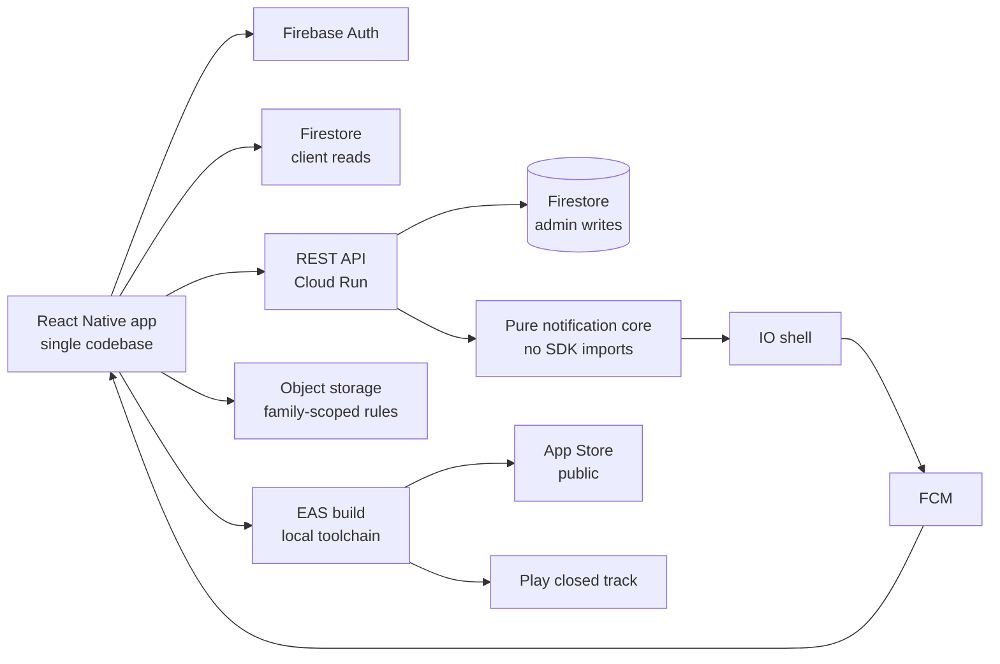

# A native social app with no over-the-air escape hatch: every JavaScript change is a store submission

**English** · [Español](README.es.md)

`Consumer / social` · `Europe` · `2026` · `In production`

## The problem

A private social network for families: shared feeds, moments, chat, challenges, a calendar,
screen-time limits for minors. One product, two operating systems, adults and children in the
same graph, and a consent regime that treats a 13-year-old differently from a 17-year-old and
both differently from an adult.

The obvious way to build this is two native codebases and two teams. That was not on the
table. The constraint was a single codebase, a small team, and a real store release — not a
demo, not a TestFlight-only artefact.

## Constraints

This is the interesting part.

- **No over-the-air updates.** The app ships without an OTA update module. There is no
  `updates` key in the app manifest and no update dependency in the package manifest. The
  consequence is absolute: *every* JavaScript change — a copy fix, a one-character bug — is a
  native rebuild and a store submission. There is no hotfix path.
- **Asymmetric distribution.** The iOS build is a public App Store release. On Android there
  is no public store listing: the submit profile
  targets a closed track with a draft release status. One codebase, two very different
  release realities.
- **A cloud build queue we did not control.** On the free build tier, a production Android
  build sat queued for hours without starting. A release
  train that depends on someone else's queue is not a release train.
- **Push delivery is unobservable from the sender.** The messaging API tells you it accepted
  a token. It does not tell you a human saw anything.
- **Time is not arithmetic.** Screen-time accounting runs on a day that starts at 08:00, in a
  timezone with daylight saving. Subtracting eight hours from a timestamp is wrong twice a year.

## Architecture

Two ideas carry the design. First, the **decision logic for notifications is a pure module**
with no SDK imports at all: it takes a recipient list, a set of preferences and an injected
clock, and returns a plan of who gets notified and why each suppressed recipient was
suppressed. Sending and reading live in a separate shell. Second, **authorisation is enforced
in storage rules, not only in the app**: object-storage paths resolve the owner's family from
the database before allowing a read.

## Stack

| Layer | Choice |
| --- | --- |
| Mobile | React Native 0.81.5 on Expo SDK 54, React 19.1.0, New Architecture enabled |
| Build | EAS Build with local credentials, remote version source, auto-increment |
| Backend | Node.js / TypeScript, Express, schema validation at the edge |
| Platform | Managed containers, single European region |
| Data | Document store, plus object storage with server-side rules |
| Identity | Managed auth: email/password, Google Sign-In, Apple authentication |

## Integrations

| System | Role |
| --- | --- |
| Firebase Auth | Identity, three sign-in methods |
| Firestore | Application data, client listeners and admin writes |
| Firebase Storage | Media, with family-scoped read rules |
| FCM | Push delivery |
| Crashlytics | Crash reporting |
| TestFlight / App Store | Public iOS distribution |
| Google Play | Closed testing track only |

## Decisions worth explaining

**No over-the-air update channel.** *Alternative considered:* ship the OTA module and keep a
hotfix lane. *Why not:* it adds a second, invisible version axis — a binary in the store and a
JavaScript bundle that may or may not match it — and it turns every crash report into a
question about which bundle was running. *Cost of the choice:* the cost is real and we pay it
every release. A one-line copy fix costs a full native build and a review cycle. The
discipline it forces is that the pre-submission checklist becomes load-bearing, because there
is no way to correct a mistake cheaply.

**Local builds as the default, not the fallback.** *Alternative considered:* stay on the
hosted build queue. *Why not:* a production build queued for hours on the free tier without
starting, and the combined "build both platforms and auto-submit" command
aborts *both* platforms when one of them hits a quota wall. *Cost of the choice:* one machine
now has to carry both native toolchains, and locally-run builds do not appear in the hosted
build list — which once produced a false alarm that nothing had shipped at all. The fix
is knowing that the hosted list is not the source of truth.

**A pure functional core for notification policy.** *Alternative considered:* check the
preferences inline where the push is sent. *Why not:* that logic is genuinely intricate — 15
notification types, each declaring whether it respects the user's category toggle, a per-thread
mute and a quiet-hours window; 3 of those types deliberately cross quiet hours because they are
safety or account-level signals. Inline, it is untestable without a live project. *Cost of the
choice:* an extra module boundary and a plan object that has to be kept in sync with the sender.
What we get is that the whole policy runs under a unit test with an injected clock, including
the case where the quiet window crosses midnight.

**Day boundary at 08:00, computed on the calendar and not on the epoch.** *Alternative
considered:* subtract eight hours from the timestamp. *Why not:* that is off by one hour on
both daylight-saving transitions, which silently misattributes screen time to the wrong day
twice a year. *How instead:* read the wall-clock hour in the target timezone with the platform
internationalisation API, then move the date by calendar arithmetic anchored at noon UTC —
never by subtracting milliseconds.

**Authorisation in the storage rules, cross-referencing the database.** *Why:* an internal
security audit found that media reads were gated on "is the caller authenticated", which is
not a boundary at all in a product whose entire premise is that families are separate. The
rules now resolve the owner's family from the user document and compare it to the caller's
before permitting a read, with per-path size caps. Profile and cover images are deliberately
left cross-family, because a profile photo is meant to be visible outside the family. *Cost of
the choice:* every media read now costs a rule-time document lookup.

## Results

This was a greenfield product, so there is no "before" to compare against. These are the
measured properties of what shipped:

| Measure | Measured value |
| --- | --- |
| Public iOS availability | public App Store release |
| Android public listing | none — closed track, draft release status |
| Notification types with declared policy | 15 (3 deliberately bypass quiet hours) |
| Backend route modules | 31 |
| User stories mapped to API contracts | 29 |
| Smoke scripts in the harness | 37 (29 backend, 8 mobile) |
| Assertions in the screen-day suite | 18, of which 5 sit on daylight-saving boundaries |

We are not publishing engagement, retention or crash-free rates here. We have not measured
them to a standard we would be willing to defend.

## The incident worth reading

A push notification was not arriving. The sender reported success. The investigation found
three *separate* silent failures stacked on top of each other, and each one had to be fixed
before the next became visible.

First, the send reported zero recipients: a full-document write elsewhere in the codebase was
overwriting the user record and wiping the device token as a side effect. Second, with the
token restored, the send reported one failure: the runtime service account lacked the messaging
permission, and the grant needed time to propagate — long enough to look like the fix
had not worked. Third, with permission granted and the send reporting success, still nothing
appeared: the app was in the foreground, where the OS hands the message to the application
instead of displaying it, and on the test device the notification permission had been revoked.

The generalisable lesson is that **"the API accepted it" and "a human saw it" are different
claims, and only one of them is in your logs.** The fixes were a guard against the overwriting
write, an in-app banner for foreground messages — built with framework primitives on purpose,
so that it required no new native dependency and therefore no rebuild — and explicit error
logging for every per-message failure that is not a known-dead token.

## What we would do differently

Keep the coverage matrix honest, or delete the column. The project maintains a document
mapping user stories to API contracts, and it is genuinely useful — 29 stories, each pointing
at its endpoints and its implementation. But its *test* column was filled in almost nowhere,
while real test evidence accumulated in 37 smoke scripts and a separate results log. A column
that is never true is worse than no column: it invites you to read coverage off a document
that does not know what the harness actually runs. Either the matrix is generated from the
harness, or it should not claim to describe it.

## Our role

End-to-end: architecture, mobile and backend implementation, release engineering on both
platforms, security review, and production operation.

Client identified by sector only, by our own policy. No client is named in this repository.
No client code, credentials or user data appear in this write-up.
