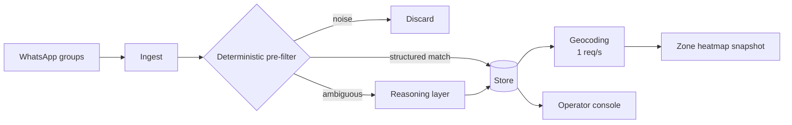

# Clasificar leads inmobiliarios entre el ruido de WhatsApp, con un 11% de fallos y 1/12 de la factura de LLM

[English](README.md) · **Español**

`Inmobiliario` · `América Latina` · `2026` · `En producción`

## El problema

Una red de agencias recibe sus leads como mensajes de WhatsApp, en chats de grupo, escritos
como escribe la gente de verdad: sin estructura, sin campos de formulario, con abreviaturas,
media ubicación y un precio que lo mismo es un alquiler mensual que una venta. Alguien tiene
que convertir cada uno de esos mensajes en un registro con tipo de operación, tipo de
inmueble y zona, o el lead no es trabajable.

Hacerlo con un LLM en cada mensaje entrante es fácil y da buenos resultados. También es una
factura que crece de forma lineal con el tráfico, y la mayor parte de ese tráfico ni siquiera
es un lead.

## Restricciones

Esta es la parte interesante.

- **Casi todo el tráfico es ruido.** En los grupos hay saludos, bromas y coordinación. Pagar
  a un modelo por leerlo todo es pagar por el ruido.
- **La geocodificación estaba limitada a 1 petición por segundo** por el proveedor externo.
  Ese único número acabó provocando un incidente (más abajo).
- **El scheduler podía solaparse consigo mismo.** Una ejecución que dura más que su intervalo
  significa dos ejecuciones cobrando el mismo trabajo dos veces.
- **La precisión había que medirla, no afirmarla.** "Clasifica bien" no es algo que puedas
  poner delante de un equipo de operaciones que tiene que fiarse del resultado.

## Arquitectura

La forma de la solución es que **el modelo es el último recurso, no la puerta de entrada.**
Una capa determinista de expresiones regulares resuelve lo que se puede resolver con reglas y
descarta lo que obviamente no es un lead. Solo el resto, el genuinamente ambiguo, llega a la
capa de razonamiento.

## Stack

| Capa | Elección |
| --- | --- |
| Runtime | Node.js / TypeScript |
| Plataforma | Contenedores gestionados, jobs programados |
| Datos | Almacén documental con TTL por colección |
| IA/ML | Gama de LLM pequeña y rápida, con tope de tokens de salida |

## Integraciones

| Sistema | Papel |
| --- | --- |
| Pasarela de WhatsApp | Ingesta de mensajes |
| Proveedor de geocodificación | Resolución de zona, limitado a 1 req/s |

## Decisiones que merece la pena explicar

**Primero reglas, después modelo.** *Alternativa considerada:* mandarlo todo al modelo y que
él decida. *Por qué no:* funciona, y cuesta aproximadamente doce veces más, porque pagas por
cada saludo. *Coste de la decisión:* la capa de reglas pasa a ser algo que hay que mantener —
un diccionario que se desactualiza si nadie lo vigila.

**La gama de modelo más barata, después de medir la concordancia.** *Alternativa considerada:*
quedarse en el modelo grande por seguridad. *Por qué no:* sobre un conjunto dirigido de casos
ambiguos de tipo de inmueble, las dos gamas coincidieron en 8 de 8 clasificaciones sin ningún
valor fuera del esquema, con un coste aproximadamente un 94% menor y una latencia unas 5×
menor. *Coste de la decisión:* esa concordancia se midió sobre una muestra pequeña y elegida
a propósito por difícil; justifica el cambio, pero no cierra la pregunta.

**Tope de tokens de salida.** Los tokens de razonamiento consumen presupuesto que nunca ves
en la respuesta. Un tope duro acota ese gasto invisible.

**Un lock distribuido con TTL en el scheduler.** *Por qué:* los solapamientos produjeron una
vez un día de $52. *Coste de la decisión:* ahora una ejecución atascada bloquea a la siguiente
hasta que expire el TTL — el modo de fallo pasó de "cobrado dos veces" a "retrasado una vez",
que es justo el intercambio que queríamos.

## Resultados

| Medida | Antes | Después |
| --- | --- | --- |
| Mensajes sin clasificar (zona) | 47.2% (545 / 1154) | 11.1% (128 / 1154) |
| Regresiones introducidas | — | 0 |
| Llamadas al LLM frente a modelo-para-todo | 1× | ~1/12 |
| Coste por clasificación frente a la gama mayor | 1× | ~0.06× |
| Grupos sin zona mapeada | 45 sin detectar | 0 |

Medido sobre el conjunto real completo de 1154 mensajes, no sobre una muestra sintética.

## El incidente que merece la pena leer

Un job programado reportaba fallo en el 100% de sus ejecuciones mientras su salida, de hecho,
se escribía correctamente. Parecía un bug del job. Era un problema de aritmética: el deadline
del job estaba fijado en 180 segundos, y geocodificar a una petición por segundo llevaba el
tiempo real de ejecución hasta ~688 segundos. Al job lo mataban después de haber hecho el
trabajo útil y antes de que pudiera contarlo.

La lección generalizable — y el motivo de que esté en el manual y no solo aquí — es que **el
límite de peticiones de un tercero es un sumando de tu presupuesto de timeout.** Si no lo has
multiplicado, tu deadline es una corazonada.

## Qué haríamos distinto

Auditar la completitud a partir de los datos, no de la configuración. Cuarenta y cinco grupos
estaban produciendo leads reales sin tener entrada alguna en la tabla de configuración — lo
que los hacía invisibles para todos nuestros controles de completitud, porque todos partían
de la configuración. Un control que parta del tráfico observado los habría encontrado el
primer día.

## Nuestro papel

De principio a fin: arquitectura, implementación, modelo de costes, operación en producción y
diagnóstico de incidentes.

Cliente identificado solo por sector, por política propia. En este repositorio no se nombra a ningún cliente.
En este documento no aparece código, credenciales ni datos de usuario del cliente.
