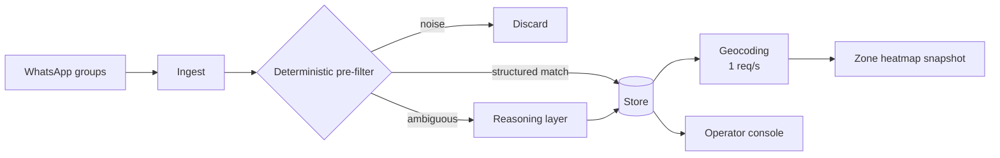

# Classifying real-estate leads from WhatsApp noise, at 11% miss rate and 1/12th the LLM bill

**English** · [Español](README.es.md)

`Real estate` · `Latin America` · `2026` · `In production`

## The problem

An agency network receives its leads as WhatsApp messages, in group chats, written the way
people actually write: no structure, no form fields, abbreviations, half a location, a price
that may be monthly rent or a sale price. Somebody has to turn each of those into a record
with an operation type, a property type and a region, or the lead is not workable.

Doing that with an LLM on every inbound message is easy and correct. It is also a bill that
grows linearly with traffic, most of which is not a lead at all.

## Constraints

This is the interesting part.

- **Most traffic is noise.** Group chats carry greetings, jokes and coordination. Paying a
  model to read all of it is paying for the noise.
- **Geocoding was rate-limited to 1 request per second** by the third-party provider. That
  single number turned out to drive an incident (below).
- **The scheduler could overlap with itself.** A run that outlives its interval means two
  runs charging the same work twice.
- **Accuracy had to be measured, not asserted.** "It classifies well" is not a claim you can
  put in front of an operations team that has to trust the output.

## Architecture

The shape of the answer is that **the model is the last resort, not the front door.** A
deterministic regex layer resolves what can be resolved by rules and discards what is
obviously not a lead. Only the genuinely ambiguous remainder reaches the reasoning layer.

## Stack

| Layer | Choice |
| --- | --- |
| Runtime | Node.js / TypeScript |
| Platform | Managed containers, scheduled jobs |
| Data | Document store with per-collection TTL |
| AI/ML | Small fast LLM tier, capped output tokens |

## Integrations

| System | Role |
| --- | --- |
| WhatsApp gateway | Message ingest |
| Geocoding provider | Zone resolution, rate-limited 1 req/s |

## Decisions worth explaining

**Rules first, model second.** *Alternative considered:* send everything to the model and let
it decide. *Why not:* it works, and it costs roughly twelve times more, because you pay for
every greeting. *Cost of the choice:* the rules layer is now something you maintain — a
dictionary that drifts if nobody watches it.

**The cheaper model tier, after measuring agreement.** *Alternative considered:* stay on the
larger model for safety. *Why not:* on a targeted set of ambiguous property-type cases, the
two tiers agreed on 8 of 8 classifications with no values outside the schema, at roughly 94%
lower cost and about 5× lower latency. *Cost of the choice:* that agreement was measured on a
deliberately hard, small sample; it justifies the switch, it does not retire the question.

**Capped output tokens.** Reasoning tokens consume budget you never see in the response. A
hard cap makes the invisible spend bounded.

**A distributed lock with a TTL on the scheduler.** *Why:* overlapping runs once produced a
$52 day. *Cost of the choice:* a stuck run now blocks the next one until the TTL expires —
the failure mode moved from "charged twice" to "delayed once", which is the trade we wanted.

## Results

| Measure | Before | After |
| --- | --- | --- |
| Unclassified messages (zone) | 47.2% (545 / 1154) | 11.1% (128 / 1154) |
| Regressions introduced | — | 0 |
| LLM calls vs. model-on-everything | 1× | ~1/12 |
| Cost per classification vs. larger tier | 1× | ~0.06× |
| Groups with no region mapping | 45 undetected | 0 |

Measured on the full real dataset of 1154 messages, not a synthetic sample.

## The incident worth reading

A scheduled job reported failure on 100% of its runs while its output was, in fact, being
written correctly. It looked like a job bug. It was an arithmetic one: the job's deadline was
set to 180 seconds, and geocoding at one request per second made the real runtime up to ~688
seconds. The job was being killed after it had done the useful work and before it could say
so.

The generalisable lesson — and the reason it is in the handbook rather than only here — is
that **a third party's rate limit is a term in your timeout budget.** If you did not multiply
it out, your deadline is a guess.

## What we would do differently

Audit completeness from the data, not from the config. Forty-five groups were producing real
leads while having no entry in the configuration table at all — which made them invisible to
every completeness check we had, because every check started from the config. A check that
starts from observed traffic instead would have found them on day one.

## Our role

End-to-end: architecture, implementation, cost model, production operation and incident
diagnosis.

Client identified by sector only, by our own policy. No client is named in this repository.
No client code, credentials or user data appear in this write-up.
